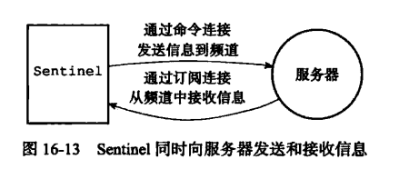
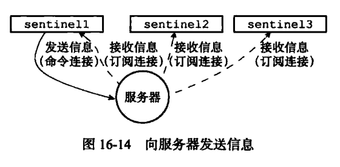
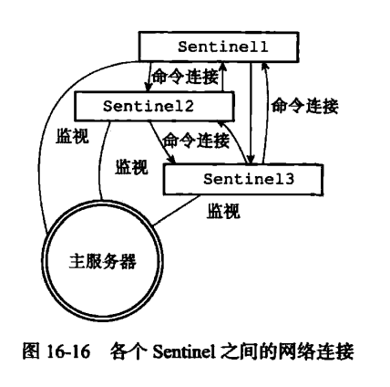
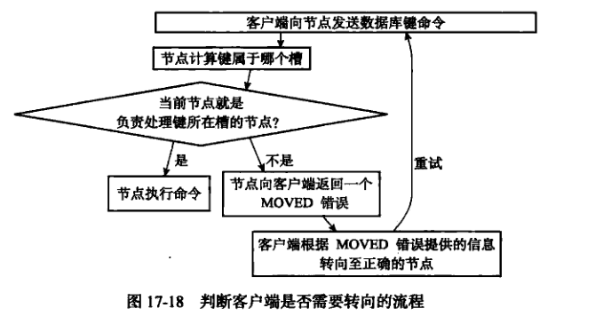
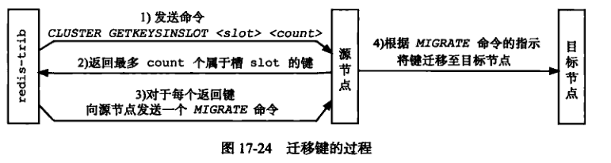
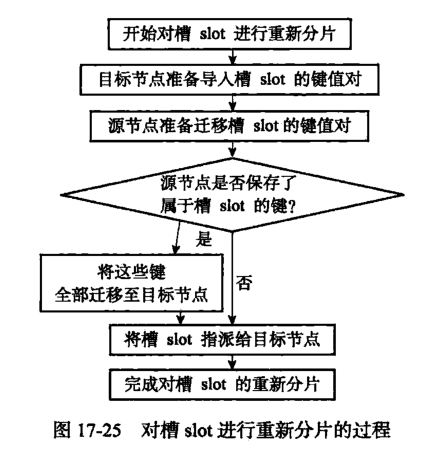
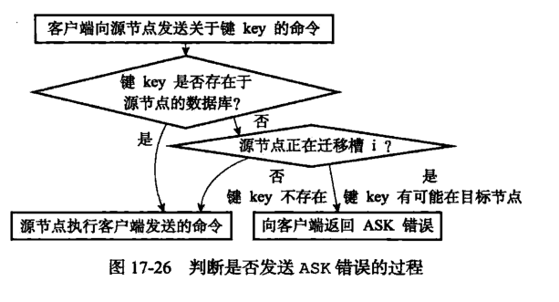

# Redis

[TOC]

## 1. SDS

```c
struct __attribute ((__packed__)) sdshdr8 {
	uint8_t len;    /* used */
	uint8_t alloc;  /* excluding the header and null terminator */
	unsigned char flags;
	char buf[];
};

struct __attribute ((__packed__)) sdshdr16 {...};
struct __attribute ((__packed__)) sdshdr32 {...};
struct __attribute ((__packed__)) sdshdr64 {...};
```

### 1.1. 说明SDS和C字符串的不同之处，解释为什么Redis要使用SDS而不是C字符串？

| C字符串                                    | SDS                                        |
| :----------------------------------------- | :----------------------------------------- |
| 获取字符串长度的复杂度为O(N)               | 获取字符串长度的复杂度为O(1)               |
| API是不安全的，可能会造成缓冲区溢出        | API是安全的，不会造成缓冲区溢出            |
| 修改字符串长度N次必然需要执行N次内存重分配 | 修改字符串长度N次最多需要执行N次内存重分配 |
| 只能保存文本数据                           | 可以保存文本或者二进制数据                 |
| 可以使用所有<string.h>库中的函数           | 可以使用部分<string.h>库中的函数           |

#### 1.1.1. O(1) 复杂度获取字符串长度

C字符串：需要遍历整个字符串

SDS：直接获取len属性

#### 1.1.2. 杜绝缓冲区溢出

strcat函数不会判断空间是否足够

sdscat函数会先检查sds空间是否满足需求，若不满足，会自动进行sds空间扩展，然后才进行修改操作。

#### 1.1.3. 内存重分配优化

内存重分配通常是一个耗时的操作。通过未使用的空间，SDS实现了空间预分配和惰性空间释放两种优化策略。

##### 1.1.3.1. 空间预分配
```c
#define SDS_MAX_PREALLOC (1024*1024)

if (newlen < SDS_MAX_PREALLOC)
	newlen *= 2;
else
	newlen += SDS_MAX_PREALLOC;
```
##### 1.1.3.2. 惰性空间释放

SDS 避免了缩短字符串时的内存重分配操作，并为未来可能的增长操作提供优化。

SDS 提供了API，需要时，可真正的释放SDS未使用的空间。

#### 1.1.4. 二进制安全

C字符串中不能包含空字符，使得C字符串只能保存文本数据，而不能保存图片/音视频等二进制数据。

#### 1.1.5. 二进制安全

SDS总会多分配一个字节来容纳末尾的空字符，这样可以让保存文本数据的SDS重用一部分<string.h>库函数。

### 1.2. 应用

- 保存数据库中的字符串
- 缓冲区
	- AOF 缓冲区
	- 客户端状态的输入缓冲区

## 2. 链表

```c
typedef struct listNode {
    struct listNode *prev;
    struct listNode *next;
    void *value;
} listNode;

typedef struct list {
    listNode *head;
    listNode *tail;
    void *(*dup)(void *ptr);
    void (*free)(void *ptr);
    int (*match)(void *ptr, void *key);
    unsigned long len;
} list;
```

### 2.1. 特性

- 双端
- 无环
- 获取表头、表尾的复杂度为O(1)
- 获取节点数量的复杂度为O(1)
- 多态：void * 指针来保存节点值，结合dup、free、match，可以保存各种不同类型的值。

### 2.2. 应用

- 列表键
	- 比如：LRANGE integers 0 10
- 发布和订阅
- 慢查询
- 监视器
- Redis服务器：
	- 使用链表保存多个服务器的信息
	- 使用链表来构建客户端输出缓冲区

## 3. 字典

```c
struct dict {
    dictType *type;

    dictEntry **ht_table[2];
    unsigned long ht_used[2];

    long rehashidx; /* rehashing not in progress if rehashidx == -1 */

    /* Keep small vars at end for optimal (minimal) struct padding */
    int16_t pauserehash; /* If >0 rehashing is paused (<0 indicates coding error) */
    signed char ht_size_exp[2]; /* exponent of size. (size = 1<<exp) */
};

typedef struct dictEntry {
    void *key;
    union {
        void *val;
        uint64_t u64;
        int64_t s64;
        double d;
    } v;
    struct dictEntry *next;     /* Next entry in the same hash bucket. */
    void *metadata[];           /* An arbitrary number of bytes (starting at a
                                 * pointer-aligned address) of size as returned
                                 * by dictType's dictEntryMetadataBytes(). */
} dictEntry;
```

### 3.1. 特性

- 底层使用哈希表
- 使用链地址法解决键冲突
- 为了让哈希表的负载因子（load factor）维持在一个合理的范围内，程序通过rehash操作来扩展和收缩哈希表
- 每个字典带有两个哈希表，一个平时使用，另一个仅在rehash时使用
- rehash不是一次性完成的，而是分多次、渐进式地完成的。将计算工作均摊到对字典的添加、删除、查找、更新操作上。

### 3.2. 应用

- 数据库
- 哈希键

## 4. 跳跃表

```c
typedef struct zskiplistNode {
    sds ele;
    double score;                        // 分值
    struct zskiplistNode *backward;      // 后退指针
    struct zskiplistLevel {
        struct zskiplistNode *forward;   // 前进指针
        unsigned long span;              // 跨度
    } level[];  // 层
} zskiplistNode;

typedef struct zskiplist {
    struct zskiplistNode *header, *tail;  // 跳跃表头尾节点
    unsigned long length;                 // 节点数量（不算表头）
    int level;          // 层数最大的那个节点的层数（不算表头）
} zskiplist;
```

### 4.1. 特性

- zskiplist用于保存跳跃表信息（头尾节点、长度）、zskiplistNode用于表示跳跃表节点
- 每个跳跃表节点的层高都是 1 至 32 之间的随机数
- 同一个跳跃表中，多个节点可以包含相同的score，但ele必须是唯一的
- 节点按score大小进行排序（升序），分值相同时，按ele排序

#### 4.1.1. 随机生成层数

```c
#define ZSKIPLIST_P 0.25      /* Skiplist P = 1/4 */

int zslRandomLevel(void) {
    static const int threshold = ZSKIPLIST_P*RAND_MAX;
    int level = 1;
    while (random() < threshold)
        level += 1;
    return (level<ZSKIPLIST_MAXLEVEL) ? level : ZSKIPLIST_MAXLEVEL;
}
```

随机：采用类似幂律分布的方式，较高的level不太可能返回

- 首先，random 随机结果 < threshold 的概率为 P
- level 为 1 的概率为 1-P
- level 为 2 的概率为 P(1-P)
- level 为 3 的概率为 P^2(1-P)
- level 为 4 的概率为 P^3(1-P)
- ......

一个节点的平均层数为：1(1-p) + 2P(1-P) +  3P^2(1-P) + 4P^3(1-P) + ... ≈ 1/(1-P)

所以，当 P = 1/4 时，每个节点所包含的平均指针数目为1.33 。这也是Redis里的skiplist实现在空间上的开销。

#### 4.1.2. 插入

简要步骤：

1. 查找插入位置
2. 为新节点随机生成level，并调整表最大层数
3. 创建并插入新节点，更新指向新节点的每一层forward指针和span
4. 层数大于新节点层数的前置节点，span加1
5. 调整新节点的backward指针
6. 表长度加1

```c
zskiplistNode *zslInsert(zskiplist *zsl, double score, sds ele) {
	// update 记录每一层需要指向新节点的节点，x 为新节点
    zskiplistNode *update[ZSKIPLIST_MAXLEVEL], *x;
    // rank 记录每一层需要指向新节点的节点排名，用于更新span值
    unsigned long rank[ZSKIPLIST_MAXLEVEL];
    int i, level;

    serverAssert(!isnan(score));
    
    // 查找插入位置
    x = zsl->header;
    for (i = zsl->level-1; i >= 0; i--) {
        /* store rank that is crossed to reach the insert position */
        rank[i] = i == (zsl->level-1) ? 0 : rank[i+1];
        while (x->level[i].forward &&
                (x->level[i].forward->score < score ||
                    (x->level[i].forward->score == score &&
                    sdscmp(x->level[i].forward->ele,ele) < 0)))
        {
            rank[i] += x->level[i].span;
            x = x->level[i].forward;
        }
        update[i] = x;
    }
    
    // 随机生成新节点的level
    level = zslRandomLevel();
    
    // 如果新节点的level超过了最大层数
    if (level > zsl->level) {
    	// 增加的这些层，需要更新header节点指向新节点，先记录该层需更新的节点（设置为header）
        for (i = zsl->level; i < level; i++) {
            rank[i] = 0;
            update[i] = zsl->header;
            update[i]->level[i].span = zsl->length;
        }
        // 修改表最大层数
        zsl->level = level;
    }
    // 创建新节点
    x = zslCreateNode(level,score,ele);
    for (i = 0; i < level; i++) {
    	// 插入新节点，针对新节点的每一层，修改链表指针
        x->level[i].forward = update[i]->level[i].forward;
        update[i]->level[i].forward = x;

        // 修改新节点每一层的span值
        x->level[i].span = update[i]->level[i].span - (rank[0] - rank[i]);
        // 修改指向新节点的节点每一层的span值
        update[i]->level[i].span = (rank[0] - rank[i]) + 1;
    }

    // 对于节点层数大于新节点的前置节点，给它们的span+1
    for (i = level; i < zsl->level; i++) {
        update[i]->level[i].span++;
    }

	// 设置新节点的后退指针
    x->backward = (update[0] == zsl->header) ? NULL : update[0];
    if (x->level[0].forward)
    	// 设置后退指针指向新节点
        x->level[0].forward->backward = x;
    else
        zsl->tail = x;
    // 表长度加1
    zsl->length++;
    return x;
}
```

### 4.2. 应用

- 有序集合键
- 在集群节点中用作内部数据结构

### 4.3. skiplist 和 平衡树、哈希表 的比较（Redis为什么用skiplist而不用平衡树？）

- skiplist 和 平衡树 的元素是有序排列的，而哈希表不是有序的。因此，哈希表上只能做单个Key查找，不适用做 **范围查找**（指的是查找那些大小在指定的两个值之间的所有节点）。
- 在做范围查找的时候，平衡树比skiplist操作要复杂。在平衡树上，我们找到指定范围的小值之后，还需要以中序遍历的顺序继续寻找其它不超过大值的节点。这里的中序遍历不易实现。**而在skiplist上进行范围查找就非常简单，只需要在找到小值之后，对第1层链表进行若干步的遍历就可以实现。**
- **平衡树的插入和删除操作可能引发子树的调整，逻辑复杂，而skiplist的插入和删除只需要修改相邻节点的指针，操作简单又快速。**
- 从内存占用上来说，skiplist比平衡树更灵活一些。平衡树每个节点包含2个指针，而skiplist每个节点包含的指针数目平均为1/(1-p)。
- 查找单个key，**skiplist和平衡树的时间复杂度都为O(log n)**。而哈希表在保持较低的哈希值冲突概率的前提下，查找时间复杂度接近O(1)，性能更高一些。
- 从算法实现难度上来比较，skiplist比平衡树要简单得多。

### 4.4. 参考资料

http://zhangtielei.com/posts/blog-redis-skiplist.html
https://leetcode.cn/problems/design-skiplist/
https://zhuanlan.zhihu.com/p/340929045

## 4. 整数集合

```c
typedef struct intset {
    uint32_t encoding;
    uint32_t length;
    int8_t contents[];
} intset;
```

### 4.1. 特性

- 底层实现为数组，以有序、无重复的方式保存集合元素
- 升级操作为整数集合带来了操作上的灵活性，并尽可能地节约内存
- 不支持降级

#### 4.1.1. 升级

1. 根据新元素类型，扩展整数集合底层数组的空间大小，并为新元素分配空间
2. 将底层数组所有元素转换为新类型，并放置到正确位置上
3. 将新元素添加到底层数组里面

### 4.2. 应用

- 集合键（当一个集合只包涵整数值元素，并且这个集合的元素数量不多时，Redis就会使用整数作为集合键的底层实现）

## 5. 压缩列表

```c
-------------------------------------------------------------------------
|  zlbytes   |   zltail   |   zllen   | entry1 | ... | entryN |  zlend  |
-------------------------------------------------------------------------
|  uint32_t  |  uint32_t  |  uint16_t |          ...          | uint8_t |
```

- `zlbytes`：记录整个压缩列表占用的内存字节数
- `zltail`  ：记录起始地址到表尾节点的字节数
- `zllen`    ：zllen < UINT16_MAX 记录压缩列表包含的节点数量；zllen == UINT16_MAX，节点的真实数量需要遍历整个列表得出。
- `zlend`    ：特殊值 0xFF，用于标记压缩列表的末端


```c
-------------------------------------------------------------------------
|  previous_entry_length  |      encoding       |   content   |
-------------------------------------------------------------------------
|       1 or 5 bytes      |  1 or 2 or 5 bytes  |     ...     |
```

- `previous_entry_length`： 记录前一个节点的长度。如果前一个节点长度小于 254 字节，则previous_entry_length占用 1 字节。否则，占用5字节，第一个字节设置为 0xFE，后面四个字节保存前一节点的长度。
- `encoding`： 记录了节点的content属性所保存数据的类型和长度，前两位编码代表类型：
	- 00：1 字节长的数组编码，content长度 小于 1 << 6 
	- 01：2 字节长的数组编码，content长度 小于 1 << 14 
	- 10：5 字节长的数组编码，content长度 小于 1 << 32 （只使用后面4个字节） 
	- 11：整数编码（占用1字节）
- `content`：保存节点的值，可以是字节数组或整数

### 5.1. 连锁更新

添加新节点或删除节点，可能会引发连锁更新操作（平均O(n)，最坏O(n^2)），但这种操作出现的几率并不高。

为了让每个节点的previous_entry_length都符合压缩列表对节点的要求，程序需要不断地对压缩列表执行空间重分配操作，直到entryN为止。

最坏情况下，需执行N次空间重分配，每次空间重分配的最坏复杂度为O(N)，所以连锁更新的最坏复杂度为O(n^2)。

### 5.2. 应用

- 列表键（当一个列表键只包含少量列表项（小整数值、短字符串），Redis就会使用压缩列表来做列表键的底层实现）
- 哈希键（当一个哈希键只包含少量键值对（小整数值、短字符串），Redis就会使用压缩列表来做哈希键的底层实现）

## 6. 对象

```c
typedef struct redisObject {
    unsigned type:4;
    unsigned encoding:4;
    unsigned lru:LRU_BITS; /* LRU time (relative to global lru_clock) or
                            * LFU data (least significant 8 bits frequency
                            * and most significant 16 bits access time). */
    int refcount;
    void *ptr;
} robj;
```

Redis数据库保存的键值对，键总是一个字符串对象，值可以是字符串对象、列表对象、哈希对象、集合对象、有序集合对象。

`TYPE` 命令返回的结果是 数据库键对应 **值的对象类型**
`OBJECT ENCODING` 命令可以查看 数据库键对应 **值对象的编码**

对象类型和对象编码：
| 类型   | 编码                |
| ------ | ------------------- |
| string | int、embstr、raw    |
| list   | quicklist           |
| hash   | listpack、hashtable |
| set    | intset、hashtable   |
| zset   | listpack、skiplist  |

备注：redis后面用listpack替代ziplist。

看源码定义，zipmap、linkedlist、ziplist不再使用了。
```c
#define OBJ_ENCODING_RAW 0     /* Raw representation */
#define OBJ_ENCODING_INT 1     /* Encoded as integer */
#define OBJ_ENCODING_HT 2      /* Encoded as hash table */
#define OBJ_ENCODING_ZIPMAP 3  /* No longer used: old hash encoding. */
#define OBJ_ENCODING_LINKEDLIST 4 /* No longer used: old list encoding. */
#define OBJ_ENCODING_ZIPLIST 5 /* No longer used: old list/hash/zset encoding. */
#define OBJ_ENCODING_INTSET 6  /* Encoded as intset */
#define OBJ_ENCODING_SKIPLIST 7  /* Encoded as skiplist */
#define OBJ_ENCODING_EMBSTR 8  /* Embedded sds string encoding */
#define OBJ_ENCODING_QUICKLIST 9 /* Encoded as linked list of listpacks */
#define OBJ_ENCODING_STREAM 10 /* Encoded as a radix tree of listpacks */
#define OBJ_ENCODING_LISTPACK 11 /* Encoded as a listpack */
```

### 6.1. 为什么有序集合需要同时使用跳跃表和字典实现？
```c
typedef struct zset {
    dict *dict;
    zskiplist *zsl;
} zset;
```

首先，

- 跳跃表用于范围操作
- 字典用于ele到score的映射

1. 单独使用字典，字典是无序的，如果做范围操作（ZRANK、ZRANGE），需要排序至少O(NlogN)复杂度，额外O(N)内存空间。
2. 单独使用跳跃表，根据ele查找score复杂度将从O(1)变为O(logN)。

### 6.2. 内存回收

Redis在对象中使用 **引用计数** 实现内存回收机制

### 6.3. 对象共享

多个键共享同一个值对象：
1. 将数据库键的值指针指向一个现有的值对象
2. 将被共享的值对象的引用计数加 1

## 7. 数据库

```c
struct redisServer {
	...
    redisDb *db;
    int dbnum;                      /* Total number of configured DBs */
    ...
};
```
初始化服务器时，会创建dbnum个数据库。（默认 16 个）

```c
static struct config {
    int dbnum; /* db num currently selected */
} config;

int main(int argc, char **argv) {
    config.dbnum = 0;
}
```
redis-cli 默认选择0号数据库，可以使用 SELECT 命令切换数据库。

```c
typedef struct redisDb {
    dict *dict;                 /* The keyspace for this DB */
    dict *expires;              /* Timeout of keys with a timeout set */
    dict *blocking_keys;        /* Keys with clients waiting for data (BLPOP)*/
    dict *ready_keys;           /* Blocked keys that received a PUSH */
    dict *watched_keys;         /* WATCHED keys for MULTI/EXEC CAS */
};
```
使用dict保存了数据库中所有的键值对，称这个字典为键空间。
操作：`SET`、`GET`、`DEL`、`FLUSHDB`、`RANDOMKEY`、`EXISTS`、`KEYS`...
过期操作：`EXPIRE`、`PEXPIRE`、`EXPIREAT`、`PEXPIREAT`、’`TTL`、`PTTL`

### 7.1. Redis 过期键删除策略

1. 惰性删除（expireIfNeeded）
	所有读写数据库的命令在执行之前都会调用 expireIfNeeded 做检查：
	a. 键过期，则删除
	b. 键未过期，则不做动作
2. 定期删除（activeExpireCycle）
	在规定时间内，分多次遍历各个数据库，从db->expires字典中检查一部分键的过期时间，并删除其中的过期键。

- 生成RDB文件时，过期键不会被保存。
- 载入RDB文件时，
	- master模式：过期键被忽略。
	- slave模式：过期键被载入。（主从同步会清空从数据库，无影响）
- 过期键被删除后，AOF文件中会追加 DEL 命令。
- 过期键不会被保存到重写后的AOF文件中。
- 复制模式下，
	- 主服务器删除过期键，会向所有从服务器发送DEL命令
	- 从服务器执行读命令时，即使键过期，也不会被删除
	- 从服务器只有接收到主服务器的DEL命令，才会删除过期键

### 7.2. 数据库通知

redis命令对数据库进行修改后，服务器会根据配置向客户端发送数据库通知。

## 8. RDB 持久化

- SAVE 命令会阻塞Redis服务器进程
- BGSAVE 会派生子进程处理
- 如果开启了AOF，服务器会优先使用AOF文件来还原数据库状态。
- 服务器在载入 RDB 文件期间，会一直处于阻塞状态
- 用户通过配置save选项，让服务器每隔一段时间自动执行一次BGSAVE命令。
- RDB文件是一个经过压缩的二进制文件，对于不同类型的键值对，会使用不同的方式保存。

## 8. AOF 持久化

- 命令请求会先保存到 `AOF缓冲区`，之后再定期写入并同步到AOF文件。
- AOF重写：从数据库中读取键现在的值，然后用一条命令去记录键值对，代替之前记录这个键值对的多条命令。
- AOF重写放在子进程中执行，redis服务器会维护一个 `AOF重写缓冲区` ，在子进程创建新AOF文件期间，记录服务器执行的所有写命令。子进程完成工作后，服务器会将AOF重写缓冲区的内容追加到新AOF文件末尾，使得数据库状态保持一致。

## 9. 客户端

```c
typedef struct client {
    connection *conn;
    redisDb *db;            /* Pointer to currently SELECTed DB. */
    robj *name;             /* As set by CLIENT SETNAME. */
    sds querybuf;           /* Buffer we use to accumulate client queries. */
    struct redisCommand *cmd, *lastcmd;  /* Last command executed. */
} client;
```

伪客户端：
1. 负责执行lua脚本的伪客户端
2. 负责执行AOF文件命令的伪客户端

## 10. 主从复制

`PSYNC` 命令具有 `完整重同步` 和 `部分重同步`两种模式：

- 完整重同步（首次复制）：让主服务器创建并发送RDB文件，以及向从服务器发送保存在缓冲区的写命令
- 部分重同步（断线后重复制）：主服务器将断线期间执行的写命令发送给从服务器
	- 主/从服务器的复制偏移量
	- 主服务器的复制积压缓冲区
	- 服务器的运行ID

命令使用：`PSYNC replicationid offset`

### 10.1. 复制积压缓冲区

由主服务器维护的一个`固定长度的先进先出队列`。

缓冲区大小设置：`2 * second * write_size_per_second`

- second：从服务器断线重连所需平均时间
- write_size_per_second：主服务器平均每秒写命令的数据量

### 10.2. 复制的实现

命令：`SLAVEOF host port`

1. 设置主服务器的地址和端口
2. 建立套接字连接
3. 发送 PING 命令
	a. 检查套接字读写状态是否正常
	b. 检查主服务器能否正常处理命令请求
4. 身份验证
5. 发送端口信息
6. 同步（从 向 主 发送 PSYNC命令）
7. 命令传播（同步完成后，主从服务器进入命令传播阶段，主 一直将自己的写命令发送给 从）

### 10.3. 心跳检测

命令：`REPLCONF ACK offset`

offset 是从服务器当前的复制偏移量

有三个作用：

- 检测主从服务器的网络连接状态
- 辅助实现 min-slaves 选型
- 检测命令丢失

## 11. 哨兵

```c
struct sentinelState {
    char myid[CONFIG_RUN_ID_SIZE+1]; /* This sentinel ID. */
    dict *masters;      /* Dictionary of master sentinelRedisInstances.
                           Key is the instance name, value is the
                           sentinelRedisInstance structure pointer. */
} sentinel;

typedef struct sentinelRedisInstance {
    int flags;      /* See SRI_... defines */
    char *name;     /* Master name from the point of view of this sentinel. */
    char *runid;    /* Run ID of this instance, or unique ID if is a Sentinel.*/
    sentinelAddr *addr; /* Master host. */
    dict *sentinels;    /* Other sentinels monitoring the same master. */
    dict *slaves;       /* Slaves for this master instance. */
} sentinelRedisInstance;
```

对于每个被监视的主/从服务器，Sentinel 会创建两个连向主/从服务器的网络连接：

- 命令连接，用于向服务器发送命令，并接受命令回复
- 订阅连接，用于订阅服务器的 `__sentinel__:hello` 频道

### 11.1. 获取主/从服务器信息

Sentinel 默认每`10`秒一次，通过命令连接向主服务器发送 `INFO` 命令，并分析命令回复：

- 主服务器的：run_id、role
- 从服务器的：ip、port、state、offset、lag  （根据ip:port，可自动发现从服务器）

Sentinel 默认每`10`秒一次，通过命令连接向从服务器发送 `INFO` 命令，并分析命令回复：

- 从服务器的：run_id、role
- 主服务器的：master_ip、master_port、master_link_status、...

### 11.2. 订阅频道

默认情况下，Sentinel 会`2`秒一次，通过命令连接向所有被监视的主/从服务器发送：

`PUBLISH __sentinel__:hello "<s_ip>,<s_port>,<s_runid>,<s_epoch>,<m_name>,<m_ip>,<m_ip>,<m_epoch>,"`

当 Sentinel 与一个主/从服务器建立 `订阅连接` 后，Sentinel就会通过订阅连接，发送：

`SUBSCRIBE __sentinel__:hello`

所以，每个 Sentinel存在两个连接：

- 通过命令连接发送信息到频道
- 通过订阅连接从频道接收信息



多个 Sentinel的情形：



当Sentinel通过频道信息发现一个新的Sentinel时，它不仅会为新的Sentinel在`sentinelRedisInstance->sentinels`字典中创建相应实例结构，还会创建一个连向新Sentinel的命令连接，而新的Sentinel也同样会创建连向这个Sentinel的命令连接。



### 11.3. 下线

#### 11.3.1. 主观下线

默认情况下，Sentinel会每秒一次向所有与它创建了命令连接的实例（主、从、其他Sentinel）发送`PING`命令，并通过返回回复来判断是否在线。

Sentinel配置文件中 `sentinel down-after-milliseconds mymaster 30000`指定了Sentinel判断实例进入主观下线所需的时间。

`sentinelRedisInstance->flags`属性中打开`SRI_S_DOWN`，表示进入主观下线状态

#### 11.3.1. 客观下线

当 Sentinel 将一个主服务器判断为 `主观下线` 后，它会向同样监视这个主服务器的其他Sentinel进行询问，看它们是否也认为主服务器已经进入了下线状态（可以是主观，或者客观）。当接收到足够数量的已下线判断，Sentinel将会判定`从服务器`为客观下线，并对`主服务器`执行`故障转移`操作。

询问其他Sentinel是否同意主服务器已下线：

`SENTINEL is-master-down-by-addr <ip> <port> <current_epoch> <runid>`

客观下线判断条件：

`sentinel monitor mymaster 127.0.0.1 6379 2`

当认为主服务器已下线的Sentinel数量，超过设置的参数值时，该Sentinel就会认为主服务器进入客观下线状态。

`sentinelRedisInstance->flags`属性中打开`SRI_O_DOWN`，表示进入客观下线状态。

### 11.4. 选举领头

当一个主服务器被判断为客观下线时，监视这个下线主服务器的各个Sentinel会进行协商，选举出一个领头Sentinel，并由领头Sentinel对下线主服务器进行故障转移操作。

1. 所有在线的Sentinel都会参与选举
2. 所有Sentinel都有一次将某个Sentinel设置为局部领头Sentinel的机会，一旦设置，不能更改
3. 每个发现主服务器进入客观下线Sentinel都会要求其他Sentinel将自己设置为局部领头
4. 发送`SENTINEL is-master-down-by-addr`命令，runid参数为发送方的runid（不是 * ），表示要求接收方将发送方设置为局部领头
5. 接收方采用`先到先得`的方式，后接收到的设置请求都会拒绝
6. 接收方回复中`leader_runid`和`leader_epoch`记录了局部领头的runid和epoch
7. 发送方收到回复后，检查`leader_runid`和`leader_epoch`是否和自己一致，**如果某个Sentinel被半数以上的Sentinel设置成了局部领头，那么这个Sentinel就成为领头。**
8. 给定时间内，未选举出领头，将在结束后再次选举，直到选出为止。

### 11.5. 故障转移

选举成功后，领头Sentinel对已下线的主服务器执行故障转移：
1. 在已下线主服务器的所有从服务器里面，挑选一个，转换为主服务器

	> - 挑选规则：
	> 	- 删除下线的从服务器
	> 	- 删除最近5秒内没有回复过领头Sentinel INFO命令的从服务器
	> 	- 删除与已下线主服务器连接断开超过`down-after-milliseconds * 10`毫秒的从服务器
	> 	- 依次按照从服务器的 `priority`最大、`offset`最大、`runid`最小 进行排序
	> - 发送`SLAVEOF no one`，使其转为主服务器

2. 将所有从服务器改为 replication 新的主服务器

	> - 发送`SLAVEOF <new_master_ip> <new_master_port>`

3. 将已下线主服务器改为 replication 新的主服务器

	> - 待重新上线时，Sentinel就会发送`SLAVEOF <new_master_ip> <new_master_port>`

### 11.6. Raft 算法

https://blog.csdn.net/daaikuaichuan/article/details/98627822

## 12. 集群
```c
struct redisServer {
	...
    int cluster_enabled;      /* Is cluster enabled? */
    struct clusterState *cluster;  /* State of the cluster */
    ...
};

typedef struct clusterState {
    clusterNode *myself;  /* This node */
    uint64_t currentEpoch;
    int state;            /* CLUSTER_OK, CLUSTER_FAIL, ... */
    int size;             /* Num of master nodes with at least one slot */
    dict *nodes;          /* Hash table of name -> clusterNode structures */
    clusterNode *slots[CLUSTER_SLOTS];
} clusterState;

typedef struct clusterNode {
    mstime_t ctime; /* Node object creation time. */
    char name[CLUSTER_NAMELEN]; /* Node name, hex string, sha1-size */
    int flags;      /* CLUSTER_NODE_... */
    unsigned char slots[CLUSTER_SLOTS/8]; /* slots handled by this node */
    int numslots;   /* Number of slots handled by this node */
    char ip[NET_IP_STR_LEN];    /* Latest known IP address of this node */
    int port;                   /* Latest known clients port (TLS or plain). */
    clusterLink *link;          /* TCP/IP link established toward this node */
} clusterNode;

typedef struct clusterLink {
    mstime_t ctime;             /* Link creation time */
    connection *conn;           /* Connection to remote node */
    sds sndbuf;                 /* Packet send buffer */
    char *rcvbuf;               /* Packet reception buffer */
    size_t rcvbuf_len;          /* Used size of rcvbuf */
    size_t rcvbuf_alloc;        /* Allocated size of rcvbuf */
    struct clusterNode *node;   /* Node related to this link. Initialized to NULL when unknown */
    int inbound;                /* 1 if this link is an inbound link accepted from the related node */
} clusterLink;
```

命令：`CLUSTER MEET <ip> <port>`


节点A和节点B握手之后，A 会将 B 的信息通过 Gossip 协议传播给集群的其他节点，让其他节点也与节点 B 进行握手，最终，节点 B 会被集群中的所有节点认识。

### 12.1. 槽

redis集群通过分片的方式来保持数据库中的键值对，集群的整个数据库被分为 `16384` 个槽（slot）。 当每个槽都有节点处理时，集群处于上线状态；否则，任何一个槽没有得到处理，集群处于下线状态。

分配槽：`CLUSTER ADDSLOTS <slot> [slot ...]`

节点除了会记录自己槽，还会将自己的槽信息告知到其他节点。

`clusterState->slots`记录了集群中所有槽的指派信息。这样检查槽是否被分配，取得负责槽的节点，仅为O(1)复杂度。

#### 12.1.1. 为什么使用`clusterState->slots`，还要使用`clusterNode->slots` ?

- 槽信息通告到其他节点时，直接发送`clusterNode->slots`就可以了
- 如果不使用`clusterNode->slots`，而单独使用`clusterState->slots`，那么每次通告槽信息，都需要遍历整个`clusterState->slots`数组，来统计当前节点负责处理那些槽，然后才能发送当前节点的槽信息。较为麻烦和低效。

### 12.2. 执行命令



#### 12.2.1. 节点数据库

集群节点保存键值对以及其过期方式，与单机redis服务器完全相同。

区别是：节点只能使用0号数据库，单机没限制。

```c
typedef struct redisDb {
    dict *dict;                 /* The keyspace for this DB */
    dict *expires;              /* Timeout of keys with a timeout set */
    clusterSlotToKeyMapping *slots_to_keys; /* Array of slots to keys. Only used in cluster mode (db 0). */
} redisDb;
```

`slots_to_keys` 保存槽和键之间的关系

### 12.3. 重新分片

可以将任意数量已经指派给某个节点的槽改为指派给另一节点，并且相关槽所属的键值对也会从源节点移动到目标节点。

重新分片可以在线进行，集群不需要下线，且源、目标节点均可继续处理命令请求。





#### 12.3.1. ASK错误



### 12.4. 复制和故障转移

设置从节点：`CLUSTER REPLICATE <node_id>`

```c
typedef struct clusterNode {
	int numslaves;  /* Number of slave nodes, if this is a master */
    struct clusterNode **slaves; /* pointers to slave nodes */
    struct clusterNode *slaveof; /* pointer to the master node. Note that it
                                    may be NULL even if the node is a slave
                                    if we don't have the master node in our
                                    tables. */
    list *fail_reports;         /* List of nodes signaling this as failing */
} clusterNode;

typedef struct clusterNodeFailReport {
    struct clusterNode *node;  /* Node reporting the failure condition. */
    mstime_t time;             /* Time of the last report from this node. */
} clusterNodeFailReport;
```

#### 12.4.1. 故障检测

- 集群中的每个节点都会定期向其他节点发送 PING 消息，规定时间内未回复 PONG 消息，则标记为`疑似下线（probeble fail，PFAIL）`。
- 集群各个节点会通过互相发送消息来交换集群中各个节点的状态信息（节点状态：在线、疑似下线、已下线）
- 半数以上负责处理槽的主节点都将某个节点 x 报告为疑似下线，那么这个 x 节点将被标记为已下线，然后将x标记为已下线的节点`会向集群广播` 主节点x的FAIL消息，所有收到这条FAIL消息的节点都会立即将主节点x标记为已下线。
- `fail_reports`记录了所有其他节点对该节点的下线报告

#### 12.4.2. 故障转移

当一个从节点发现自己正在复制的主节点进入了已下线状态，从节点开始对下线主节点进行故障转移：

- 挑选一个从节点
- 执行SLAVEOF no one，成为新主节点
- 新主节点会撤销所有对已下线主节点的槽，并将这些槽分配给自己
- 新主节点向集群广播 PONG消息，让集群其他节点知道：1. 我变成了主节点；2. 我接管了之前的槽
- 新主节点开始接收和处理自己负责槽有关的命令请求，故障转移完成。

#### 12.4.3. 选举

- 当从节点发现主节点已下线，向集群广播`CLUSTERMSG_TYPE_FAILOVER_AUTH_REQUEST`消息，要求收到消息的主节点，向这个从节点投票。
- 如果收到消息的主节点具有投票权，且尚未投票给其他从节点，那么主节点返回`CLUSTERMSG_TYPE_FAILOVER_AUTH_ACK` 消息，表示支持。
- 没个参与选举的从节点都会收到`CLUSTERMSG_TYPE_FAILOVER_AUTH_ACK` 消息，并统计自己获得的票数。
- 如果大于半数，则这个从节点当选。
- 如果没能成功，则再次选举，直到选出。

### 12.5. 消息

集群节点发送的消息有：

- MEET 消息
- PING 消息
- PONG 消息
- FAIL 消息
- PUBLISH 消息

## 13. 发布和订阅

订阅频道：`SUBSCRIBE channel [channel ...]`

订阅模式：`PSUBSCRIBE pattern [pattern ...]`

发布消息：`PUBLISH channel message`

退订频道：`UNSUBSCRIBE [channel [channel ...]]`

退订频道：`PUNSUBSCRIBE [pattern [pattern ...]]`

```c
struct redisServer {
    dict *pubsub_channels;  /* Map channels to list of subscribed clients */
    dict *pubsub_patterns;  /* A dict of pubsub_patterns */
};
```

## 14. 事务

命令：`MULTI`、`EXEC`、`WATCH`

```c
typedef struct client {
    multiState mstate;      /* MULTI/EXEC state */
} client;

typedef struct multiState {
    multiCmd *commands;     /* Array of MULTI commands */
    int count;              /* Total number of MULTI commands */
    int cmd_flags;          /* The accumulated command flags OR-ed together.
                               So if at least a command has a given flag, it
                               will be set in this field. */
    int cmd_inv_flags;      /* Same as cmd_flags, OR-ing the ~flags. so that it
                               is possible to know if all the commands have a
                               certain flag. */
    size_t argv_len_sums;    /* mem used by all commands arguments */
} multiState;
```

`WATCH` 命令，可以监视任意数量的数据库键，并在EXEC命令执行时，检查被监视的键是否至少有一个已经被修改过了，如果是，服务器将拒绝执行事务，并返回空回复。

```c
typedef struct redisDb {
    dict *watched_keys;         /* WATCHED keys for MULTI/EXEC CAS */
} redisDb;
```

### 14.1. ACID

Redis 事务具有以下性质：

- 原子性（Atomicity）
- 一致性（Consistency）：指没有包含非法或无效的错误数据
- 隔离性（Isolation）：Redis使用单线程执行，且执行事务期间不会被中断。（事务以串行方式运行）
- 耐久性（Durability）：根据RDB或AOF来保证


## 15. 排序

```c
typedef struct _redisSortObject {
    robj *obj;
    union {
        double score;
        robj *cmpobj;
    } u;
} redisSortObject;
```

SORT 命令为每个被排序的键都创建一个与键长度相同的数组，数组的每个项都是redisSortObject结构。

选项：`ALPHA`、`ASC`、`DESC`、`BY`、`LIMIT`、`GET`、`STORE`、

## 16. 二进制位数组

- redis 使用 `SDS` 保存位数组
- SDS 使用`逆序`来保存位数组。（简化SETBIT命令；便于对位数组进行空间扩展）
- 命令：`SETBIT`、`GETBIT`、`BITCOUNT`、`BITOP`

## 17. 慢查询日志

- `slowlog-log-slower-than` 指定执行时间超过多少微妙的命令请求会被记录到日志上
- `slowlog-max-len` 指定服务器最多保存多少条慢查询日志

```c
struct redisServer {
    list *slowlog;                  /* SLOWLOG list of commands */
    long long slowlog_entry_id;     /* SLOWLOG current entry ID */
    long long slowlog_log_slower_than; /* SLOWLOG time limit (to get logged) */
    unsigned long slowlog_max_len;     /* SLOWLOG max number of items logged */
};

typedef struct slowlogEntry {
    robj **argv;
    int argc;
    long long id;       /* Unique entry identifier. */
    long long duration; /* Time spent by the query, in microseconds. */
    time_t time;        /* Unix time at which the query was executed. */
    sds cname;          /* Client name. */
    sds peerid;         /* Client network address. */
} slowlogEntry;
```

## 18. 监视器

- 客户端执行`MONITOR`命令，将转换为监视器，接收并打印服务器处理的每个命令请求。
- 标识：REDIS_MONITOR
- 服务器将监视器记录在monitors链表中
- 每次处理命令请求，服务器会遍历monitor链表，将相关信息发给监视器

```c
struct redisServer {
    list *monitors;    /* List of MONITORs */
};
```

## 19. 事件

### 19.1. 文件事件

### 19.2. 时间事件

## 20. 总结

### 20.1. 事件类

#### 20.1.1. 性能高的原因，IO多路复用的原理以及其他优点

#### 20.1.2. 设计定时任务框架

### 20.2. 锁类
#### 20.2.1. 如何实现一个分布式锁，如果保证锁被一个任务占用后超出时间后，其他任务是正常的

### 20.3. 高可靠类

#### 20.3.1. 主从复制（具体过程，需注意什么问题）
#### 20.3.2. 哨兵、集群

### 20.4. 持久化类

#### 20.4.1. 持久化原理、优缺点

#### 20.4.1. redis哈希表扩容时宕机了怎么恢复数据

## X. FK

https://baijiahao.baidu.com/s?id=1718316080906441023&wfr=spider&for=pc
