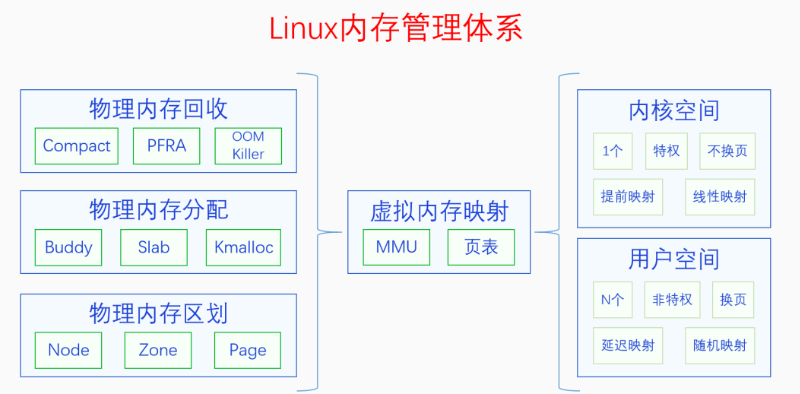
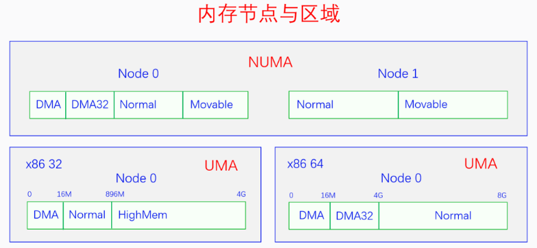
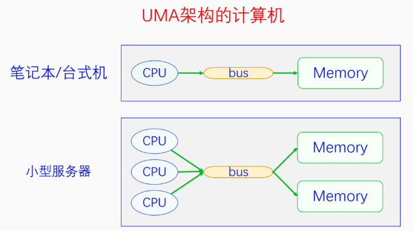
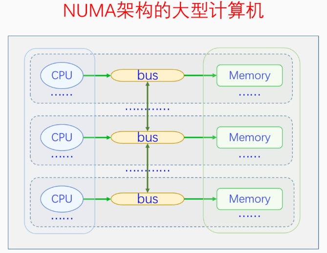
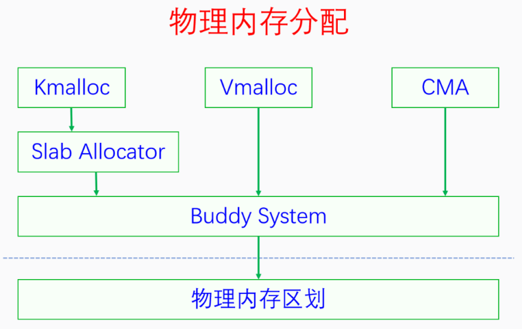
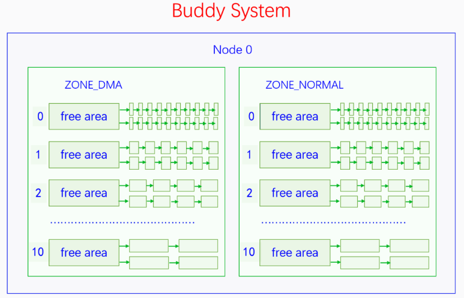
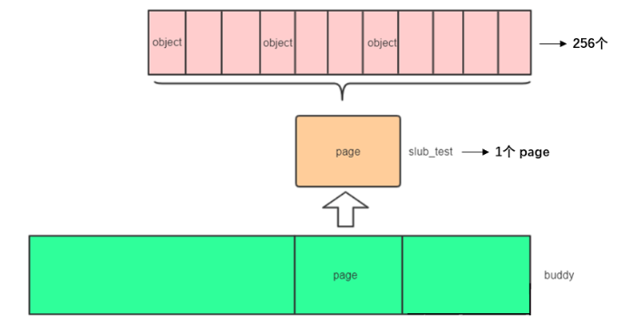

# 内存管理

## 1. 内存管理的发展

### 1.1. 早期内存管理

早期的内存管理，大家都运行在物理内存上，内核和进程运行在一个空间中。
内存分配算法有：首次适应算法（FirstFit）、最佳适应算法（BestFit）、最差适应算法（WorstFit）

存在的问题：

- 内核和进程之间没有隔离，进程可以随意访问内核数据。
- 内核和进程没有权限的区分，进程可以随意做敏感操作。
- 当时物理内存非常少，能同时运行的进程少

### 1.2. 分段内存管理

在分段内存中，软件把物理内存分成一个一个的段，每个段都有段基址和段限长，还有段类型和段权限。

`段基址和段限长`确定一个段的范围，防止内存访问越界。
`段类型`分为代码段和数据段。代码段是只读和可执行的；数据段分为只读数据段和读写数据段。
`段权限`分为有特权（内核权限）和无特权（用户权限）。

分段内存管理解决的问题：

- 内核和进程的隔离实现了。
- CPU特权实现了，进程无法再执行敏感指令了。
- 内存访问安全性提高了，一定程度上遏制了越界访问。

存在的问题：

- **物理内存非常少**（当时是让进程自己解决，编写程序时要想好让关联不大的模块占用相同的物理地址，然后动态加载待运行的模块）

### 1.3. 分页内存管理

也叫**虚拟内存管理**。

<u>【Q：什么是虚拟内存？解决了什么问题？】</u>

在虚拟内存中，CPU访问任何内存都是通过虚拟内存地址访问的，但实际上最终访问内存还是用物理内存地址。所以在CPU中存在一个MMU，负责把虚拟地址转化为物理地址，然后再去访问内存。

MMU把虚拟地址转化为物理地址，需要使用页表，页表是由内核负责创建和维护的。

【实现了 进程之间的隔离】

一套页表用来表达一个虚拟内存空间，不同的进程可以用不同的页表集，页表集可以不停的切换，哪个进程正在运行就切换到哪个进程的页表集。所以**一个进程就只能访问自己的虚拟内存空间，而访问不了别人的虚拟内存空间。**

【实现了 内核和进程之间的隔离】

一个虚拟内存空间分为两部分：内核空间和用户空间。
内核空间只有一个，用户空间有N个，所有的虚拟内存空间都共享同一个内核空间。内核运行在内核空间，进程运行在用户空间，内核空间有特权，用户空间无特权，用户空间不能随意访问内核空间。

【实现了 权限管理】

CPU运行内核空间代码时，会把自己设置为特权模式，可以执行所有指令。CPU运行用户空间代码时，把自己设置为用户模式，只能执行普通指令。

【解决了 物理内存不足】

系统刚启动时运行在物理内存上的，内核也被全部加载到物理内存。然后内核建立页表体系并开启分页机制，内核的物理内存和虚拟内存就建立映射了，整个系统就运行在虚拟内存上了。

内核会记录进程的虚拟内存分配情况，但是并不会马上分配物理内存建立页表映射，而是让进程先运行着。
进程运行的时候，CPU通过MMU访问虚拟内存时，MMU会用页表去解析虚拟内存，如果找到了对应的物理地址就直接访问，如果页表项是空的，就会触发**缺页异常**，在缺页异常中会去分配物理内存并建立页表映射。然后重新执行指令，CPU通过MMU访问到物理内存。
当物理内存不足时，内核还会把一部分物理内存解除映射，把其内容放到外存中，等其再次需要的时候再加载回来。这样一个进程运行的时候并不需要立马加载其全部内容到物理内存，进程只需要少量的物理内存就能顺利地运行，于是系统运行进程的吞吐量就大大提高了。

### 1.4. 内存管理的目标

- 进程之间的隔离
- 内核与进程之间的隔离
- 减少物理内存并发使用的数量
- 减少内存碎片。（包括外部碎片和内部碎片）
	- 外部碎片：指还在内存分配器中的碎片，由于比较分散，无法满足大块连续内存分配。
	- 内部碎片：指你申请了5个字节，分配器给你分配了8个字节的内存。这3个字节是内部碎片。
- 内存分配接口要灵活多样。（既能满足大块连续内存分配，又能满足小块零碎内存分配）
- 内存分配效率要高。
- 提供物理内存的利用率。（及时回收物理内存，内存压缩）

### 1.4. 内存管理体系



虚拟内存空间分为两部分：内核空间和用户空间。

|      |内核空间|用户空间|
| ---- | ---- | ---- |
| 个数  | 1个  | N个  |
|页表映射|在内核启动的早期建立|在程序运行过程中通过缺页异常逐步建立|
|映射方式|线性映射|随机映射（用户空间页表是运行时动态创建的）|
|是否换页|不换页|会换页|

换页是内存回收中的操作。内核页表建立好之后就不会取消了，用户页表可能会因为内存回收而取消。

## 2. 物理内存区划

三级区划：`Node -> Zone -> Page`



### 2.1. 节点






<u>【Q：物理内存为什么划分节点？】</u>

当一个系统中的CPU、内存越来越多的时候，内存总线就会成为一个系统的瓶颈。于是可以把一部分CPU和一部分内存直连在一起，构成一个节点，不同节点之前CPU访问内存采用间接方式。节点内的内存访问速度就会很快，节点之间的内存访问虽然慢，但可以尽量减少节点之间的内存访问，这样系统总的内存访问速度就会很快。

Linux代码中对UMA和NUMA是统一处理的，把UMA看成一个只有一个节点的NUMA。控制内核编译选项CONFIG_NUMA来定义支持情况。

```c
// 节点描述符
typedef struct pglist_data {
} pg_data_t;

// 对于UMA，定义唯一的一个节点
#ifndef CONFIG_NUMA
struct pglist_data __refdata contig_page_data;
EXPORT_SYMBOL(contig_page_data);
#endif
static inline struct pglist_data *NODE_DATA(int nid)
{
 return &contig_page_data;
}

// 对于NUMA，定义节点指针数组
struct pglist_data *node_data[MAX_NUMNODES] __read_mostly;
EXPORT_SYMBOL(node_data);
#define NODE_DATA(nid)  (node_data[nid])
```

### 2.2. 区域

<u>【Q：内存节点为什么划分区域？】</u>

主要是因为各种软硬件的限制。Linux目前最多有6个区域，并不是每个区域都必然存在。

- **`ZONE_DMA`**：由CONFIG_ZONE_DMA决定是否存在。早期ISA总线上的DMA控制器只有24根地址总线，只能访问16M物理内存。为了兼容老设备，专门开辟前16M物理内存作为一个区域。
- **`ZONE_DMA32`**：由CONFIG_ZONE_DMA32决定是否存在。后来DMA控制器有32根地址总线，可以访问4G物理内存了。但32位系统上最多只支持4G物理内存，所以没必要专门划分一个区域。但64位系统的时候，CPU支持48位~52位，需专门划分一个区域给32位的DMA控制器使用。
- **`ZONE_NORMAL`**：常规内存，必然存在。
- **`ZONE_HIGHMEM`**：高端内存，由CONFIG_HIGHMEM决定是否存在。只有在32位系统上有，因为32位系统内核空间只有1G，这1G虚拟空间中有128M用于其他用途，所以只有896M的虚拟内存空间用于直接映射物理内存。而32位系统支持的物理内存有4G，大于896M的物理内存无法直接映射到内核空间，所以把他们划分为高端内存。64位系统不需要高端内存区域。
- **`ZONE_MOVABLE`**：可移动内存，必然存在，用于可热插拔的内存。
- **`ZONE_DEVICE`**：设备内存，由CONFIG_ZONE_DEVICE决定是否存在。用于放置持久内存（掉电后内容不消失）

```c
typedef struct pglist_data {
	struct zone node_zones[MAX_NR_ZONES];
} pg_data_t;

// 区域描述符
struct zone {
	const char		*name;
};
```

### 2.3. 页面

<u>【Q：内存区域为什么划分页面？】</u>

内存页面不是因为硬件限制才有的，主要是出于逻辑原因才有的。页面是分页内存机制和底层内存分配的最小单元。

如果没有页面，直接以字节为单位管理太麻烦。页面太大或太小都不好，还需要是2的整数次幂，4K就非常合适。为什么选4K？最早Intel的选择，后面大部分CPU跟着选4K作为页面大小了。

```c
struct page {
	unsigned long flags;	// 页状态
	atomic_t _refcount;		// 引用计数
	void *virtual;			// 虚拟地址 Kernel virtual address (NULL if not kmapped, ie. highmem) 
} _struct_page_alignment;
```

## 3. 物理内存分配



### 3.1. 伙伴系统

伙伴系统管理的内存并不是全部的物理内存，而是内核在完成初步的初始化之后的`未使用内存`。内核在刚启动的时候，使用`memblock`来做早期内存分配。当基础初始化完成后，就会把所有剩余可用的物理内存交给伙伴系统来管理。

伙伴系统不是管理一个个页帧的，而是把页帧组成页块来管理。页块由2^n个页帧组成，n叫阶，n的范围是[0, 10]。
**`页帧对齐`**：首页帧的页帧号(pfn)必须能够除尽2^n。（比如3阶页块的首页帧必须除8能够除尽）

```c
// 区域描述符
struct zone {
	struct free_area	free_area[MAX_ORDER];
};

// 伙伴系统的管理数据
struct free_area {
	struct list_head	free_list[MIGRATE_TYPES];
	unsigned long		nr_free;
};
```



<u>【Q：伙伴系统的算法逻辑？】</u>

伙伴系统对外提供的接口只能分配某一阶的页块，并不能随意分配若干个页帧。当分配n阶页块时，伙伴系统会优先查找n阶页块的链表，如果不为空的话就拿出来一个分配。如果为空的就去找n+1阶页块的链表，如果不为空的话，就拿出来一个，并分成两个n阶页块，其中一个加入n阶页块的链表中，另一个分配出去。重复此逻辑，直到找到10阶页块的链表。

如果10阶页块的链表也是空的话，那就去找后备迁移类型的页块去分配，此时从最高阶的页块链表往低阶页块的链表开始查找，直到查到为止。如果后备页块也分配不到内存，那么就会进行内存回收。

用户用完内存还给伙伴系统的时候，需要先进行合并（取当前页块的前面或后面的free且同阶页块进行合并），直到无法合并为止，然后将其插入到对应的页块链表中。合并的时候需要满足`页帧对齐`的要求。

```c
// 分配 1 << order 个连续的物理页，返回指向首页的指针
struct page *alloc_pages(gfp_t gfp, unsigned int order);
void __free_pages(struct page *page, unsigned int order);
```

参数`gfp`：分为两类标记，一类指定分配区域，一类指定分配行为。

<u>【Q：是不是指定了哪个区域就只能在哪个区域分配内存呢？】</u>

每个区域都有后备区域，当区域内存不足时，就会从后备区域中分配内存。

```c
// 节点描述符
typedef struct pglist_data {
	// 后备区域
	struct zonelist node_zonelists[MAX_ZONELISTS];
} pg_data_t;

enum {
	ZONELIST_FALLBACK,	/* zonelist with fallback */
#ifdef CONFIG_NUMA
	/*
	 * The NUMA zonelists are doubled because we need zonelists that
	 * restrict the allocations to a single node for __GFP_THISNODE.
	 */
	ZONELIST_NOFALLBACK,	/* zonelist without fallback (__GFP_THISNODE) */
#endif
	MAX_ZONELISTS
};
```

在UMA上，后备区域只有一个链表，就是本节点内的后备区域。
在NUMA上，后备区域有两个链表，包括本节点、其他节点的后备区域。

```c
enum zone_type {
#ifdef CONFIG_ZONE_DMA
	ZONE_DMA,
#endif
#ifdef CONFIG_ZONE_DMA32
	ZONE_DMA32,
#endif
	ZONE_NORMAL,
#ifdef CONFIG_HIGHMEM
	ZONE_HIGHMEM,
#endif
	ZONE_MOVABLE,
#ifdef CONFIG_ZONE_DEVICE
	ZONE_DEVICE,
#endif
	__MAX_NR_ZONES
};
```
对于本节点的后备区域，按照区域类型的ID排列的（降序）。前面的区域内存不足时，可以从后面的区域分配内存，反过来则不行。
对于其他节点的后备区域，除了上诉规则，还会考虑是按照`节点优先`排列还是按照`区域类型优先`排列。

### 3.2. Slab 分配器

`slob`：针对嵌入式系统优化
`slub`：针对内存比较多的系统优化

由于现在计算机内存都比较大，除了嵌入式系统外，内核默认使用**`slub`**。


```c
struct kmem_cache *kmem_cache_create(const char *name, unsigned int size,
	unsigned int align, slab_flags_t flags, void (*ctor)(void *));
void kmem_cache_destroy(struct kmem_cache *);
void *kmem_cache_alloc(struct kmem_cache *, gfp_t flags);
void kmem_cache_free(struct kmem_cache *, void *);
```

slab从伙伴系统中申请一个order为0的页，然后把这一页分成很多小的object。当我们使用时，从slab中获取一个object，用完了归还给slab即可。



```c
// 高速缓存描述符，用于管理slab缓存
struct kmem_cache {
	// 对于每个CPU，相当于一个本地内存缓存池，当分配内存时，优先从本地CPU分配内存以保证cache命中率。
	struct kmem_cache_cpu __percpu *cpu_slab;

	unsigned int size;	/* The size of an object including metadata */
	unsigned int object_size;/* The size of an object without metadata */
	const char *name;	/* Name (only for display!) */
	
	// 系统有个slab_caches链表，所有slab都会挂入此链表
	struct list_head list;	/* List of slab caches */
	
	// NUMA系统中，每个node都有一个kmem_cache_node，相当于共享内存缓存池
	struct kmem_cache_node *node[MAX_NUMNODES];
};

// 描述本地内存缓存池
struct kmem_cache_cpu {
	void **freelist;	/* Pointer to next available object */
	unsigned long tid;	/* Globally unique transaction id */
	
	// slab 内存的page指针
	struct page *page;	/* The slab from which we are allocating */
#ifdef CONFIG_SLUB_CPU_PARTIAL
	// 本地slab partial链表，是一些部分分配了object的slab
	struct page *partial;	/* Partially allocated frozen slabs */
#endif
};

// 描述共享内存池
struct kmem_cache_node {
	spinlock_t list_lock;
#ifdef CONFIG_SLUB
	// slab 节点中slab的数量
	unsigned long nr_partial;
	// partial链表
	struct list_head partial;
#endif
};
```

高速缓存被划分为slab，slab由一个或多个连续物理页组成。一般情况下，slab由一页组成。


```c
kmem_cache_create
	create_cache
		kmem_cache_zalloc // 1. 分配kmem_cache结构
			kmem_cache_alloc
				slab_alloc
					slab_alloc_node
		__kmem_cache_create // 2. 初始化kmem_cache结构
			kmem_cache_open
		list_add // 3. 将创建的kmem_cache添加到全局链表slab_caches中，构成slab缓存池
```

```c
kmem_cache_alloc
    slab_alloc
        slab_alloc_node
            if (!object) // 如果kmem_cache_cpu里的freelist没有可用的object
                __slab_alloc
                    ___slab_alloc
                      slub_percpu_partial  // 2.接着去 kmem_cache_cpu->partital链表中分配，如果此链表为null
                      new_slab_objects
                          get_partial  // 3.接着去 kmem_cache_node->partital链表分配，如果此链表为null
                          new_slab  // 4.这就需要重新分配一个slab了。
                              allocate_slab 
            else
                get_freepointer_safe  // 1.先从 kmem_cache_cpu->freelist中分配，
```

### 3.3. kmalloc

kmalloc底层用的是slab机制，kmalloc在启动的时候会预先创建一些不同大小的slab，用户请求分配任意大小的内存，kmalloc都会寻找大小刚好合适的slab来分配内存。

```c
void *kmalloc(size_t size, gfp_t flags);
void kfree(const void *);
```

系统启动时，会调用create_kmalloc_caches，来创建不同大小的kmem_cache，并存储在kmalloc_caches中。

```c
/*
 * kmalloc_info[] is to make slub_debug=,kmalloc-xx option work at boot time.
 * kmalloc_index() supports up to 2^25=32MB, so the final entry of the table is
 * kmalloc-32M.
 */
const struct kmalloc_info_struct kmalloc_info[] __initconst = {
	INIT_KMALLOC_INFO(0, 0),
	INIT_KMALLOC_INFO(96, 96),
	INIT_KMALLOC_INFO(192, 192),
	INIT_KMALLOC_INFO(8, 8),
	INIT_KMALLOC_INFO(16, 16),
	INIT_KMALLOC_INFO(32, 32),
	INIT_KMALLOC_INFO(64, 64),
	INIT_KMALLOC_INFO(128, 128),
	INIT_KMALLOC_INFO(256, 256),
	INIT_KMALLOC_INFO(512, 512),
	INIT_KMALLOC_INFO(1024, 1k),
	INIT_KMALLOC_INFO(2048, 2k),
	INIT_KMALLOC_INFO(4096, 4k),
	INIT_KMALLOC_INFO(8192, 8k),
	INIT_KMALLOC_INFO(16384, 16k),
	INIT_KMALLOC_INFO(32768, 32k),
	INIT_KMALLOC_INFO(65536, 64k),
	INIT_KMALLOC_INFO(131072, 128k),
	INIT_KMALLOC_INFO(262144, 256k),
	INIT_KMALLOC_INFO(524288, 512k),
	INIT_KMALLOC_INFO(1048576, 1M),
	INIT_KMALLOC_INFO(2097152, 2M),
	INIT_KMALLOC_INFO(4194304, 4M),
	INIT_KMALLOC_INFO(8388608, 8M),
	INIT_KMALLOC_INFO(16777216, 16M),
	INIT_KMALLOC_INFO(33554432, 32M)
};
```

<u>【Q：kmalloc最大可以分配多少内存？】</u>

不同系统配置，支持情况不同。直接看代码。

```c
kmalloc
	// slab 实现
	__kmalloc
		__do_kmalloc
			// 最大申请内存 4M
			if (unlikely(size > KMALLOC_MAX_CACHE_SIZE))
				return NULL;

	// slub 实现
	__kmalloc
		// 如果大于 8K，直接使用alloc_pages申请内存。
		// 这里可以看到这里已经不属于slub管理器了，直接使用了伙伴系统。
		if (unlikely(size > KMALLOC_MAX_CACHE_SIZE))
			return kmalloc_large(size, flags);
				kmalloc_order
					alloc_pages

	// slob 实现
	__kmalloc
		__do_kmalloc_node
			slob_new_pages
				alloc_pages
```

### 3.4. vmalloc

```c
void *vmalloc(unsigned long size);
void vfree(const void *addr);
```

kmalloc：分配的内存，虚拟地址和物理地址都是连续的。
vmalloc：分配的内存，虚拟地址是连续的，物理地址不一定是连续的。

vmalloc最小分配一个page，并且分配到的页面不保证是连续的，vmalloc内部调用alloc_page多次分配单个页面。
vmalloc的区域就是在VMALLOC_START - VMALLOC_END之间。

```c
```