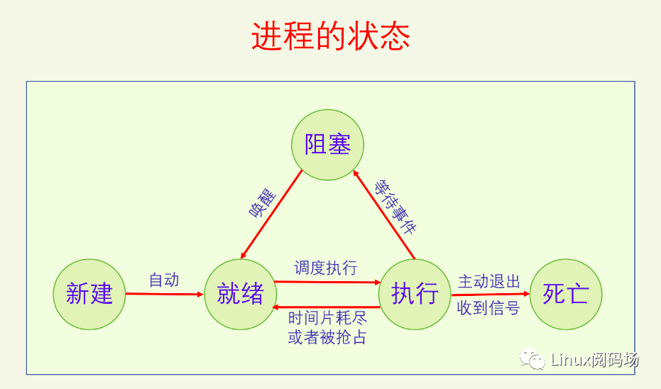
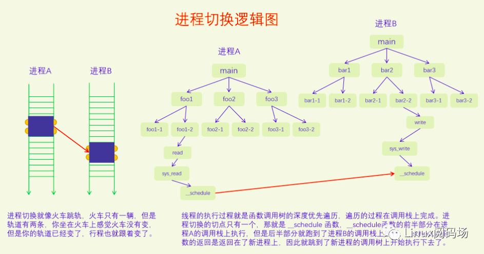

# 进程调度

## 1. 概览

### 1.1. 什么是调度

调度是CPU资源管理器。所有进程的运行都需要CPU，对CPU该如何管理呢？

一般有两种管理方法：一种是`时间分割管理`，另一种是`空间分割管理`。

由于CPU自身的特性，没有空间分割相似性，只有时间分割相似性，所以我们只能对CPU进行时间分割管理。`对CPU进行时间分割管理`的具体做法就叫做进程调度。

进程是资源分配的单位，线程是执行的单位。所以进程调度调度的是线程。

对线程的调度可以有两种方式：

- 直接调度线程，（称直接调度或者一级调度）
- 先调度进程，再在进程内部调度线程，（称间接调度或者二级调度）

POSIX规定，操作系统可以选择这两种方式中的任何一种都行。Linux选择的是一级调度，为什么？

- 主要是提高并发，充分利用多CPU多核的优势。一级调度可以使得 计算量小的进程少开线程，计算量大的进程多开线程。

Linux也推出了cgroup组调度机制，来限制某个或者某一类进程对CPU资源的过度占用。后文都是假设没有cgroup组调度。

### 1.2. 为什么要调度

有了调度就有了多任务，电脑体验会非常好。

- 程序运行过程中等待IO，CPU只能空转，浪费CPU资源
- 程序一直做运算，就会一直霸占CPU

所以需要抢占，抢占分为：

- 用户抢占。
- 内核抢占。由config选项控制。开启会提高系统的响应性但降低性能，关闭会提高性能但降低响应性。

### 1.3. 如何调度？

- 主动调度。由进程触发
- 被动调度。由中断触发

执行调度分：

- 选择进程，就是调度算法了；
- 切换进程：分两步，切换用户空间、切换执行栈（线程栈）
	- 切换用户空间：是CPU架构的事情，在x86 CPU上是给CR3寄存器赋值新进程的页表树的根指针。
	- 切换线程的内核栈：保存了线程的用户栈信息

### 1.4. 调度均衡

多个CPU之间会进行调度均衡，分：个体均衡、总体均衡。

- 个体均衡：是从进程的角度出发选择到一个相对清闲的CPU上去运行。有三个触发点：
	- 一是新进程刚创建时；
	- 二是进程要执行新程序时；
	- 三是进程被唤醒时；
- 总体均衡：是从CPU的角度出发如何从别的CPU上拉取一些进程到自己这来执行，使得所有CPU的工作量尽量平均。有三个触发点：
	- 一是CPU即将idle前会去找到最忙的CPU然后拉取一些任务过来；
	- 二是定时器中断的周期性检测，会检查是否所有的CPU都一样忙，如果忙闲差别太大就会进行进程迁移，使得所有CPU忙闲程度接近；
	- 三是在idle进程中如果CPU发现自己太忙而有的CPU在idle就会唤醒那个CPU进行负载均衡。

### 1.5. 调度器评价指标

- 响应性
- 吞吐量
- 公平性
- 适应性：指的是系统无论是调度几个进程还是调度几万个进程，都能撑得住，都能收放自如，各项指标都不能受到太大的影响。
- 节能性：省电

## 2. 框架



### 2.1. CPU调度队列

每个CPU需要一个运行队列来安放所有就绪进程

```c
// per-CPU runqueue data structure
struct rq {
	unsigned int		nr_running;

	struct cfs_rq		cfs;	// 完全公平调度队列
	struct rt_rq		rt;		// 实时调度队列
	struct dl_rq		dl;		// 限时调度队列

	struct task_struct __rcu	*curr;
	struct task_struct	*idle;	// 闲时调度，（每个CPU只能有一个进程，无需队列）
	struct task_struct	*stop;	// 禁令调度，（每个CPU只能有一个进程，无需队列）
};

DEFINE_PER_CPU_SHARED_ALIGNED(struct rq, runqueues);
```

### 2.2. 进程唤醒

进程是通过`进程唤醒`来放入运行队列的。

```c
// 新建唤醒
wake_up_new_task
	select_task_rq // 选择到哪个CPU的运行队列
	activate_task  // 把进程放入目标队列
	check_preempt_curr // 检查是否需要抢占
```

```c
// 阻塞唤醒
try_to_wake_up
	if (p == current) // 先检测被唤醒的进程是否为当前进程
		goto out
	select_task_rq // 选择到哪个CPU的运行队列
	ttwu_queue     // 把进程放入目标队列
	check_preempt_curr // 检查是否需要抢占
```

### 2.3. 调度时机

进程放入运行队列之后就等着被调度到CPU上去运行了。

当前进程正在使用CPU，它什么时候让出CPU给其他进程呢？两种情况：

- 一是当前进程主动让出CPU，这叫主动调度；
- 二是当前进程被动让出CPU，这叫被动调度，也就是进程抢占。

#### 2.3.1. 主动调度

- 自愿性主动调度，指进程主动调用sched_yield让出CPU；
- 非自愿性主动调度，指进程运行时遇到了无法继续运行的情况（加锁失败，要读的文件现在不在内存中、进程死亡），只能进行调度让其它进程运行。

如下，信号量，
```c
static inline int __sched __down_common(struct semaphore *sem, long state,
								long timeout)
{
	struct semaphore_waiter waiter;

	list_add_tail(&waiter.list, &sem->wait_list);
	waiter.task = current;
	waiter.up = false;

	for (;;) {
		if (signal_pending_state(state, current))
			goto interrupted;
		if (unlikely(timeout <= 0))
			goto timed_out;
		__set_current_state(state);
		raw_spin_unlock_irq(&sem->lock);
		timeout = schedule_timeout(timeout);
		raw_spin_lock_irq(&sem->lock);
		if (waiter.up)
			return 0;
	}

 timed_out:
	list_del(&waiter.list);
	return -ETIME;

 interrupted:
	list_del(&waiter.list);
	return -EINTR;
}
```
先定义一个等待项，把自己加入到信号量的等待列表中，然后调用schedule_timeout执行调度。

#### 2.3.2. 被动调度

被动调度的过程分为两步：`触发调度` 和 `执行调度`。

触发调度仅仅是做个标记，告诉系统需要调度了。
执行调度是系统会在某些特定的点去检查调度标记，如果被设置的话就执行调度。

触发调度的点有：

- 定时器中断；
- 唤醒进程时；
- 迁移进程时；
- 改变进程优先级时

执行调度的点有：

- 从系统调用返回用户空间；
- 从中断返回用户空间；
- 从中断返回内核空间；
- 禁用抢占临界区结束；
- 禁用软中断临界区结束；
- cond_resched调用点

##### 2.3.2.1. 定时器中断

```c
scheduler_tick
	// 调用当前进程的调度类的task_tick函数，此函数可能会触发调度
	curr->sched_class->task_tick(rq, curr, 0);
```

##### 2.3.2.2. 唤醒进程

上面的新建唤醒还是阻塞唤醒，最终都是调用check_preempt_curr函数：
```c
void check_preempt_curr(struct rq *rq, struct task_struct *p, int flags)
{
	if (p->sched_class == rq->curr->sched_class)
		// 被唤醒的进程和当前进程是同一个调度类的则会调用调度类的函数来处理
		rq->curr->sched_class->check_preempt_curr(rq, p, flags);
	else if (p->sched_class > rq->curr->sched_class)
		// 被唤醒的进程比当前进程的调度类高，则会触发调度。
		resched_curr(rq);
}

resched_curr
	set_tsk_need_resched
		// 在thread_info的flag中设置TIF_NEED_RESCHED标记。
		set_tsk_thread_flag(tsk,TIF_NEED_RESCHED);
```

##### 2.3.2.3. 系统调用返回用户空间

以x86为例：
```c
do_syscall_64
	syscall_exit_to_user_mode
		__syscall_exit_to_user_mode_work
			exit_to_user_mode_prepare
				exit_to_user_mode_loop

static unsigned long exit_to_user_mode_loop(struct pt_regs *regs,
					    unsigned long ti_work)
{
	if (ti_work & _TIF_NEED_RESCHED)
		schedule();
}
```
系统调用完成之后返回用户空间之前会检测thread_info flag中的_TIF_NEED_RESCHED，如果设置了就会执行调度。

##### 2.3.2.4. 中断返回用户空间或者内核空间

所有中断和异常的入口函数, 其中一定会调用irqentry_exit
```c
#define DEFINE_IDTENTRY_IRQ(func)        \
	...
	irqentry_exit(regs, state);          \
	...

#define DEFINE_IDTENTRY(func)         \
	...
	irqentry_exit(regs, state);       \
	...
```

```c
irqentry_exit
	// 根据寄存器状态，判断返回到用户空间还是内核空间
	
	// 返回到用户空间
	irqentry_exit_to_user_mode
		exit_to_user_mode_prepare
			exit_to_user_mode_loop
				schedule

	// 返回到内核空间
	irqentry_exit_cond_resched
		// 是否可以内核抢占
		if (!preempt_count())
			preempt_schedule_irq
```

##### 2.3.2.5. 禁用抢占临界区结束

preempt_disable增加引用计数，preempt_enable减少引用计数并检测是否为0，如果为0则执行调度。

```c
#define preempt_disable() \
do { \
	preempt_count_inc(); \
	barrier(); \
} while (0)

#define preempt_enable() \
do { \
	barrier(); \
	if (unlikely(preempt_count_dec_and_test())) \
		__preempt_schedule(); \
} while (0)
```


##### 2.3.2.6. 禁用软中断临界区结束

```c
local_bh_enable
	__local_bh_enable_ip
		preempt_count_dec
		preempt_check_resched
			__preempt_schedule
```

##### 2.3.2.7. cond_resched调用点

在很多比较耗时的内核操作中都会加上cond_resched调用，用来增加抢占调度的检测点，提高系统的响应性。

```c
cond_resched
	_cond_resched
		__cond_resched
			preempt_schedule_common
```

### 2.4. 调度流程

执行调度，就两个步骤：选择进程和切换进程。

```c
__schedule
	pick_next_task  // 选择下一个要执行的进程，涉及调度算法
	context_switch  // 切换进程
```

#### 2.4.1. 调度类


Linux中一共有五个调度类，分别是：

- stop (禁令调度类)
- deadline (限时调度类)
- realtime (实时调度类)
- time-share (分时调度类)
- idle (闲时调度类)

它们的调度紧迫性从上到下，依次降低。其中禁令调度类和闲时调度类有特殊的目的，仅用于内核，没有调度策略，由于这类进程在内核启动时就设置好了，一个CPU一个相应的进程，所以也不需要调度算法。

另外三个调度类可用于用户空间进程，有相应的调度策略和调度算法，也有相应的API供用户空间来设置一个进程的调度策略和优先级。

内核为了防止实时进程饿死普通进程，提供了一个配置参数，默认值是实时进程如果已经占用了95%的CPU时间，就会把剩余5%的CPU时间分给普通进程。

##### 2.4.1.1. 禁令调度类

禁令调度类是内核用来执行一些特别紧急的事物所使用的。禁令调度类的进程是内核在启动时就创建好的，一个CPU一个进程，名字叫做[migration/n]，n是CPU_ID，之后就不能再创建此类进程了。

调度均衡要迁移线程的时候会用到这类进程，所以它的名字叫做migration。

由于禁令调度类的进程优先级是最高的，只要此类进程变得Runnable了，就会立马抢占当前进程来运行。

##### 2.4.1.2. 限时调度类

限时调度类属于硬实时，适用于对调度时间有明确要求的进程。它只有一个调度策略，限时调度策略。

一个进程必须通过系统调用才能把自己设置为限时调度策略，并且还要提供三个参数：运行周期、运行时间和截止时间。运行周期是说这个进程在多长时间内想要运行一次，运行时间是说这个进程每次想要运行多长时间，截止时间是说这个进程每次运行结束不能晚于什么时间。

##### 2.4.1.3. 实时调度类

实时调度类属于软实时，适用于那些只要可运行就希望立马能执行的进程。

实时调度类又分为两个调度策略，SCHED_FIFO和SCHED_RR。

实时调度类的内部逻辑是让实时优先级大的进程先运行，只要有实时优先级大的进程可运行，就不会去调度实时优先级小的进程。

当两个实时进程的优先级相同时，SCHED_RR和SCHED_FIFO这两个策略就有区别了，SCHED_FIFO进程如果抢占了CPU，它就会一直占着CPU，不会给同优先级的实时进程让CPU的，而SCHED_RR进程会在运行了一定的时间片之后主动让给同优先级的实时进程。

##### 2.4.1.4. 分时调度类（公平调度类）

分时调度类是给广大的普通进程来用的，大家共同分享CPU。根据优先级的不同，可能有的进程分的多有的进程分的少，但是不会出现一个进程霸占CPU的情况。

分时调度类下面有三个调度策略：SCHED_NORMAL、SCHED_BATCH和SCHED_IDLE。

SCHED_BATCH进程希望减少调度次数，每次调度能执行的时间长一点，SCHED_IDLE是优先级特别低的进程，其分到的CPU时间的比例非常低，但是也总是能保证分到。

分时调度类现在的算法叫做CFS(完全公平调度)，所以分时调度类也叫做公平调度类。

##### 2.4.1.5. 闲时调度类

闲时调度类是给内核用的，当CPU没有其它进程可以执行的时候就会运行闲时调度类的进程。此类进程是在内核启动时就创建好的，一个CPU一个进程，此后就不能再创建此类进程了。

闲时调度类的进程也叫做idle进程，它在内核中有些特殊的用途。闲时调度类和分时调度类中SCHED_IDLE调度策略不是一回事，两者没有关系。


调度类定义：

```c
struct sched_class {
	void (*enqueue_task) (struct rq *rq, struct task_struct *p, int flags);
	void (*dequeue_task) (struct rq *rq, struct task_struct *p, int flags);
	void (*yield_task)   (struct rq *rq);
	bool (*yield_to_task)(struct rq *rq, struct task_struct *p);

	void (*check_preempt_curr)(struct rq *rq, struct task_struct *p, int flags);

	struct task_struct *(*pick_next_task)(struct rq *rq);

	void (*put_prev_task)(struct rq *rq, struct task_struct *p);
	void (*set_next_task)(struct rq *rq, struct task_struct *p, bool first);

#ifdef CONFIG_SMP
	int (*balance)(struct rq *rq, struct task_struct *prev, struct rq_flags *rf);
	int  (*select_task_rq)(struct task_struct *p, int task_cpu, int flags);

	struct task_struct * (*pick_task)(struct rq *rq);

	void (*migrate_task_rq)(struct task_struct *p, int new_cpu);

	void (*task_woken)(struct rq *this_rq, struct task_struct *task);

	void (*set_cpus_allowed)(struct task_struct *p,
				 const struct cpumask *newmask,
				 u32 flags);

	void (*rq_online)(struct rq *rq);
	void (*rq_offline)(struct rq *rq);

	struct rq *(*find_lock_rq)(struct task_struct *p, struct rq *rq);
#endif

	void (*task_tick)(struct rq *rq, struct task_struct *p, int queued);
	void (*task_fork)(struct task_struct *p);
	void (*task_dead)(struct task_struct *p);

	void (*switched_from)(struct rq *this_rq, struct task_struct *task);
	void (*switched_to)  (struct rq *this_rq, struct task_struct *task);
	void (*prio_changed) (struct rq *this_rq, struct task_struct *task,
			      int oldprio);

	unsigned int (*get_rr_interval)(struct rq *rq,
					struct task_struct *task);

	void (*update_curr)(struct rq *rq);
};

#define DEFINE_SCHED_CLASS(name) \
const struct sched_class name##_sched_class \
	__aligned(__alignof__(struct sched_class)) \
	__section("__" #name "_sched_class")

// kernel/sched/stop_task.c
DEFINE_SCHED_CLASS(stop) = {
	.enqueue_task		= enqueue_task_stop,
	.dequeue_task		= dequeue_task_stop,
	.yield_task		= yield_task_stop,
	...
};

// kernel/sched/deadline.c
DEFINE_SCHED_CLASS(dl) = {
	.enqueue_task		= enqueue_task_dl,
	.dequeue_task		= dequeue_task_dl,
	.yield_task		= yield_task_dl,
	...
};

// kernel/sched/rt.c
DEFINE_SCHED_CLASS(rt) = {
	.enqueue_task		= enqueue_task_rt,
	.dequeue_task		= dequeue_task_rt,
	.yield_task		= yield_task_rt,
	...
};

// kernel/sched/fair.c
DEFINE_SCHED_CLASS(fair) = {
	.enqueue_task		= enqueue_task_fair,
	.dequeue_task		= dequeue_task_fair,
	.yield_task		= yield_task_fair,
	.yield_to_task		= yield_to_task_fair,
	...
};

// kernel/sched/idle.c
DEFINE_SCHED_CLASS(idle) = {
	/* no enqueue/yield_task for idle tasks */
	.check_preempt_curr	= check_preempt_curr_idle,
	...
};
```

#### 2.4.2. 进程优先级

禁令调度类和闲时调度类只在内核里使用，而且一个CPU只有一个线程，所以用不到进程优先级。

限时调度类用的是进程设置的三个调度参数作为调度的依据，也用不到进程优先级。

所以就只有`实时调度类`和`分时调度类`会用到进程优先级。

API接口：
```c
#include <sched.h>
int sched_setscheduler(pid_t pid, int policy, const struct sched_param *param);
int sched_getscheduler(pid_t pid);

#include <sched.h>
int sched_setparam(pid_t pid, const struct sched_param *param);
int sched_getparam(pid_t pid, struct sched_param *param);

struct sched_param {
    int sched_priority;
};

#include <unistd.h>
int nice(int inc);
```

sched_setscheduler能同时设置实时调度类和分时调度类的调度策略和静态优先级，对于实时调度类，其静态优先级范围是1-99，99最大，对于分时调度类，其静态优先级必须设置为0，其动态优先级也就是nice需要通过nice接口来设置。sched_setparam可以设置实时进程的静态优先级，对于分时进程，其静态优先级必须为0。

task_struct中记录优先级的字段：
```c
struct task_struct {
  unsigned int      rt_priority; // 用来记录实时进程的用户空间的静态优先级
  int        static_prio; // 用于记录分时进程的用户空间的动态优先级并做了转换
  
  int        normal_prio; // rt_priority和static_prio一起转化为normal_prio(规范优先级)

  int        prio; // 最终起作用的是prio(动态优先级)，它的值默认等于normal_prio，一般不会变动。
}
```


在用户空间的时候，实时进程和普通进程(分时进程)共享同一个优先级数轴，叫静态优先级，范围是0-99，值越大优先级越高，实时进程占用1-99，普通进程占用0。普通进程自己又新开了一个数轴，叫动态优先级，也叫nice值，范围是 -20 - 19，值越低优先级越高。

到了内核空间的时候，实时进程有一个实时优先级，直接复制用户空间的静态优先级，普通进程有一个静态优先级，它是用户空间的nice值转换过来的，转换规则是nice+120。然后内核又定义了规范优先级，把它们都统一到同一个数轴上来。普通进程的规范优先级是直接复制其静态优先级，实时进程的规范优先级等于99减去它的实时优先级。在规范优先级的数轴上，所有进程都可以直接比较优先级了，值越小优先级越大。实时进程的规范优先级范围是0-99，但是由于它是从用户空间的优先级计算而来的，所以99这个值就用不到。

最后是动态优先级，对进程所有的处理都以动态优先级为准，动态优先级默认等于其规范优先级。以前的时候调度算法会去调整进程的动态优先级，现在不会再调了。现在只有使用了优先级继承锁的时候才会去调整进程的动态优先级。


对于禁令调度类、限时调度类和闲时调度类，它们用不到进程优先级，但是系统在规范优先级数轴上为它们提供了象征值，其动态优先级是对规范优先级的复制，也只有象征意义。有一个特殊的情况是分时调度类里面的SCHED_IDLE调度策略的进程，它的优先级无法在规范优先级数轴上体现出来，它的优先级是在CFS算法专门处理的，直接设置的调度权重，相当于是nice 26。

ps和top命令下的优先级体系也不相同。

**ps命令优先级：**

cls代表的是调度策略，含义如下：

- TS SCHED_OTHER/SCHED_NORMAL
- FF SCHED_FIFO
- RR SCHED_RR
- B SCHED_BATCH
- IDL SCHED_IDLE
- DLN SCHED_DEADLINE

NI代表的是nice值，范围：-20 – 19，-20最大，只有SCHED_NORMAL和SCHED_BATCH有意义。

RTPRIO代表的实时进程的用户空间优先级，范围：1 – 99，99最大，只有SCHED_FIFO和SCHED_RR有意义。

PRI，普通进程 pri = 19 - nice, 实时进程 pri = 40 + rtprio，值越大优先级越大，普通进程 0 – 39， 实时进程 41 – 139。

**top命令优先级：**

NI列是nice值，只对普通进程有效，对其它进程来说没有意义。

PR，普通进程 pr = 20 + nice，实时进程 pr = -1 - rt，rt是实时进程的用户空间优先级，PR值越小优先级越大，普通进程 0 – 39，实时进程 -2 – -100，-100会显示为rt，普通进程大于等于0，实时进程小于0。

#### 2.4.3. 选择进程

下面看pick_next_task的实现：
```c
/*
 * Pick up the highest-prio task:
 */
static inline struct task_struct *
__pick_next_task(struct rq *rq, struct task_struct *prev, struct rq_flags *rf)
{
	const struct sched_class *class;
	struct task_struct *p;

	/*
	 * Optimization: we know that if all tasks are in the fair class we can
	 * call that function directly, but only if the @prev task wasn't of a
	 * higher scheduling class, because otherwise those lose the
	 * opportunity to pull in more work from other CPUs.
	 */
	if (likely(prev->sched_class <= &fair_sched_class &&
		   rq->nr_running == rq->cfs.h_nr_running)) {

		p = pick_next_task_fair(rq, prev, rf);
		if (unlikely(p == RETRY_TASK))
			goto restart;

		/* Assume the next prioritized class is idle_sched_class */
		if (!p) {
			put_prev_task(rq, prev);
			p = pick_next_task_idle(rq);
		}

		return p;
	}

restart:
	put_prev_task_balance(rq, prev, rf);

	for_each_class(class) {
		p = class->pick_next_task(rq);
		if (p)
			return p;
	}

	/* The idle class should always have a runnable task: */
	BUG();
}
```

__pick_next_task进行了一个优化，因为大部分时间系统中主要存在的都是普通进程，所以先检测运行队列的运行数量和公平运行列队中的运行数量，如果相等的话就说明系统中目前只有普通进程，那么就可以直接调用pick_next_task_fair。

接着就是主逻辑了，先从高调度类进行选择，如果有可运行的进程就直接返回，如果没有就去查询下一个调度类。最后一定能返回一个进程的，因为idle进程总是可运行的。

#### 2.4.4. 进程切换

切换进程一共分两步：一是切换用户空间，二是切换内核栈。

```c
context_switch
	switch_mm_irqs_off  // 切换用户空间
		load_new_mm_cr3
			// x86下的实现，给寄存器CR3赋予新的值。CR3中存放的是根页表的物理地址
			build_cr3 // 把虚拟地址转化为物理地址
			write_cr3 // 给寄存器CR3写入新的物理地址
	switch_to // 切换内核栈

// prev 当前进程
// next 即将要切换的进程
// last 从哪个进程切换过来的（from）
#define switch_to(prev, next, last)					\
do {									\
	((last) = __switch_to_asm((prev), (next)));			\
} while (0)

// arch/x86/entry/entry_64.S
/*
 * %rdi: prev task
 * %rsi: next task
 */
.pushsection .text, "ax"
SYM_FUNC_START(__switch_to_asm)
	/* switch stack */
	movq	%rsp, TASK_threadsp(%rdi) // 保存当前进程的栈指针
	movq	TASK_threadsp(%rsi), %rsp // 加载next进程的栈指针

	jmp	__switch_to
SYM_FUNC_END(__switch_to_asm)
.popsection

// 每个进程的内核栈的栈指针都在task_struct中的thread.sp保存着
#define TASK_threadsp 3160 /* offsetof(struct task_struct, thread.sp) */
```

__switch_to_asm的详细解读，参考：
https://www.maizure.org/projects/evolution_x86_context_switch_linux/




## 3. CFS 完全公平调度

Linux上的分时调度算法叫CFS(Completely Fair Scheduler)完全公平调度。CFS只负责调度普通进程，包括三个调度策略NORMAL、BATCH、IDLE。

### 3.1. CFS 运行队列

CFS的运行队列是用红黑树来实现的。排序，且其插入和删除操作的效率都是O(logn)，非常高效。

```c
/* CFS-related fields in a runqueue */
struct cfs_rq {
	struct load_weight	load;
	unsigned int		nr_running;
	unsigned int		h_nr_running;      /* SCHED_{NORMAL,BATCH,IDLE} */
	unsigned int		idle_h_nr_running; /* SCHED_IDLE */
	
	u64			min_vruntime; // 运行队列的最小虚拟运行时间
	
	// Leftmost-cached rbtrees.
	struct rb_root_cached	tasks_timeline;
	/*
	 * 'curr' points to currently running entity on this cfs_rq.
	 * It is set to NULL otherwise (i.e when none are currently running).
	 */
	struct sched_entity	*curr; // 当前正在CPU上运行的进程
	...
};

struct sched_entity {
	/* For load-balancing: */
	struct load_weight		load; // 权重
	...
	u64				vruntime; // 进程的虚拟运行时间，（进程在红黑树中排队的键值）
};
```

### 3.2. 权重

```c
struct load_weight {
	// 权重
	unsigned long			weight;
	
	// inv_weight = 2^32 / weight
	// inv_weight是为了方便weight参与除法运算时而添加的。
	// 当需要除以weight的时候，你只需要乘以inv_weight然后再右移32就可以了。
	u32				inv_weight;
};
```

nice值的范围是-20到19，是等差数列。

**CFS 把 nice值 转化为等比数列的权重。为什么这样做呢？**

在nice值相差1的情况下，比如两个进程的nice值分别是0和1，时间片分别为200ms和195ms，几乎没啥区别。但是当nice值分为18和19的时候，时间片分别为10ms和5ms，两者的时间差却达到了一倍。

因此把nice值转化为等比数列的权重，再按照权重去分配CPU时间是比较合理的。

**公比计算**

为了让两个nice值只相差1的进程获得的CPU时间比例差为10%。

假设两个nice值x、y=x+1，我们希望`x/(x+y) - y/(x+y) = 10%`，求y与x的比值。

```
x/(x+y) - y/(x+y) = 10%
x-y = 0.1x + 0.1y
y/x = 0.818181
```

所以等比数列的公比为0.8。

为了二进制运算方便，把nice 0作为权重1024来进行转换。
```c
const int sched_prio_to_weight[40] = {
 /* -20 */     88761,     71755,     56483,     46273,     36291,
 /* -15 */     29154,     23254,     18705,     14949,     11916,
 /* -10 */      9548,      7620,      6100,      4904,      3906,
 /*  -5 */      3121,      2501,      1991,      1586,      1277,
 /*   0 */      1024,       820,       655,       526,       423,
 /*   5 */       335,       272,       215,       172,       137,
 /*  10 */       110,        87,        70,        56,        45,
 /*  15 */        36,        29,        23,        18,        15,
};

// Inverse (2^32/x) values of the sched_prio_to_weight[] array, precalculated.
const u32 sched_prio_to_wmult[40] = {
 /* -20 */     48388,     59856,     76040,     92818,    118348,
 /* -15 */    147320,    184698,    229616,    287308,    360437,
 /* -10 */    449829,    563644,    704093,    875809,   1099582,
 /*  -5 */   1376151,   1717300,   2157191,   2708050,   3363326,
 /*   0 */   4194304,   5237765,   6557202,   8165337,  10153587,
 /*   5 */  12820798,  15790321,  19976592,  24970740,  31350126,
 /*  10 */  39045157,  49367440,  61356676,  76695844,  95443717,
 /*  15 */ 119304647, 148102320, 186737708, 238609294, 286331153,
};
```

### 3.3. 进程状态

```c
/* Used in tsk->state: */
#define TASK_RUNNING			0x0000
#define TASK_INTERRUPTIBLE		0x0001
#define TASK_UNINTERRUPTIBLE		0x0002
#define TASK_DEAD			0x0080
#define TASK_NEW			0x0800
```

在Linux中 `就绪` 和 `执行` 都用 `TASK_RUNNING` 来表示。
```c
static inline int task_current(struct rq *rq, struct task_struct *p)
{
	return rq->curr == p;
}

// 判断进程是否处于执行状态
static inline int task_running(struct rq *rq, struct task_struct *p)
{
#ifdef CONFIG_SMP
	// 多CPU系统下，就看on_cpu字段
	return p->on_cpu;
#else
	// 单CPU系统，就判断队列当前进程是不是该进程
	return task_current(rq, p);
#endif
}

// 判断进程是否处于就绪/执行状态
#define task_is_running(task)		(READ_ONCE((task)->__state) == TASK_RUNNING)
```

### 3.4. 虚拟运行时间

进程的`虚拟运行时间`等于进程的`实际运行时间`除以`相对权重`。

更新当前进程运行统计信息：

```c
/*
 * Update the current task's runtime statistics.
 */
static void update_curr(struct cfs_rq *cfs_rq)
{
	struct sched_entity *curr = cfs_rq->curr;
	u64 now = rq_clock_task(rq_of(cfs_rq)); // 获取当前时间
	u64 delta_exec;

	// 没有运行进程，curr为NULL
	if (unlikely(!curr))
		return;

	// 进程本次运行的实际时间 = 当前时间 - 进程本次运行的开始时间
	delta_exec = now - curr->exec_start;
	...
	// calc_delta_fair把实际运行时间转化为虚拟运行时间，然后加到vruntime上
	curr->vruntime += calc_delta_fair(delta_exec, curr);
	
	// 更新运行队列的最小虚拟时间记录
	update_min_vruntime(cfs_rq);
	
	// 其他统计
}

/*
 * delta /= w
 */
static inline u64 calc_delta_fair(u64 delta, struct sched_entity *se)
{
	if (unlikely(se->load.weight != NICE_0_LOAD))
		delta = __calc_delta(delta, NICE_0_LOAD, &se->load);

	// nice 为0的进程，虚拟运行时间等于实际运行时间，直接返回实际运行时间
	return delta;
}

/*
 * delta_exec * weight / lw.weight
 *   OR
 * (delta_exec * (weight * lw->inv_weight)) >> WMULT_SHIFT
 */
static u64 __calc_delta(u64 delta_exec, unsigned long weight, struct load_weight *lw)
{...}

static void update_min_vruntime(struct cfs_rq *cfs_rq)
{
	// 先在当前进程的vruntime和队首进程的vruntime之间选择一个最小值，如果此值大于原先的min_vruntime，就更新cfs_rq->min_vruntime为此值。
	/* ensure we never gain time by being placed backwards. */
	cfs_rq->min_vruntime = max_vruntime(cfs_rq->min_vruntime, vruntime);
}
```

update_curr的调用时机：

1. 定时器中断，更新当前进程的虚拟运行时间，只有更新了之后才知道当前进程的时间片有没有用完。
2. 唤醒抢占时，也要更新当前进程的虚拟运行时间，只有更新了之后才能正确判断是否能抢占。
3. 进程被抢占离开CPU时，从触发抢占到执行抢占还有一段时间，需要更新一下虚拟运行时间。
4. 进程阻塞离开CPU时，需要更新一下虚拟运行时间。
5. 主动让出CPU时，通过sched_yield让出CPU时更新一下虚拟运行时间。
6. 当前进程更改优先级时，更改优先级会改变权重，对已经运行的时间先更新一下虚拟运行时间。
7. 执行fork时，子进程会继承父进程的vruntime，因此要更新一下父进程的vruntime。
8. 用户空间定时器要统计进程的运行时间时。
9. 调度均衡中迁移线程时入队和出队的队列都要调用update_curr，目的是为了更新min_vruntime，因为被迁移的线程要减去旧队列的min_vruntime，加上新队列的min_vruntime，所以min_vruntime的要是最新的才好。

### 3.5. 调度相关概念

调度周期的概念是指运行队列上所有的进程都运行一遍的时间，但是在CFS中没有了标准的调度周期，调度周期是动态的，只是个计算量。

调度延迟的概念是指一个进程从加入到运行队列到被放到CPU上去执行之间的时间差，显然这个时间差受进程本身和运行队列长短的影响。在CFS中，调度延迟的概念完全变了，调度延迟变成了调度周期的最小值。

调度粒度是指一个进程一次至少运行多少时间才能被抢占，这个在CFS中也是如此。

时间片的概念是指一个进程一次最多只能运行多长时间，然后就要被抢占了。在CFS中时间片的概念没有变，但是用法和传统的用法不一样。

在CFS中，调度周期等于调度粒度乘以Runnable进程的数量，但是不能小于调度延迟。时间片等于调度周期乘以进程权重与运行队列权重的比值。

### 3.6. 抢占调度

抢占调度有两个典型的触发点：`定时器中断`和`进程唤醒`。

#### 3.6.1. 定时器中断抢占

```c
struct task_struct {
	const struct sched_class	*sched_class;
	struct sched_entity		se;
};

void scheduler_tick(void)
{
	struct task_struct *curr = rq->curr;
	...
	// 执行当前进程的调度类的回调函数
	curr->sched_class->task_tick(rq, curr, 0);
}

static void task_tick_fair(struct rq *rq, struct task_struct *curr, int queued)
{
	struct cfs_rq *cfs_rq;
	struct sched_entity *se = &curr->se;

	// 没有组调度的情况下，se只有一个
	for_each_sched_entity(se) {
		cfs_rq = cfs_rq_of(se);
		entity_tick(cfs_rq, se, queued);
	}
	...
}

static void
entity_tick(struct cfs_rq *cfs_rq, struct sched_entity *curr, int queued)
{
	/*
	 * Update run-time statistics of the 'current'.
	 */
	// 先更新当前进程的运行统计
	update_curr(cfs_rq);
	...

	// 运行进程总数大于1时，进入定时器抢占逻辑
	if (cfs_rq->nr_running > 1)
		check_preempt_tick(cfs_rq, curr);
}

/*
 * Minimal preemption granularity for CPU-bound tasks:
 *
 * (default: 0.75 msec * (1 + ilog(ncpus)), units: nanoseconds)
 */
 unsigned int sysctl_sched_min_granularity			= 750000ULL;

/*
 * Preempt the current task with a newly woken task if needed:
 */
static void
check_preempt_tick(struct cfs_rq *cfs_rq, struct sched_entity *curr)
{
	unsigned long ideal_runtime, delta_exec;
	struct sched_entity *se;
	s64 delta;

	// 计算进程的理想运行时间
	ideal_runtime = sched_slice(cfs_rq, curr);
	
	// 计算进程的实际运行时间
	delta_exec = curr->sum_exec_runtime - curr->prev_sum_exec_runtime;
	
	// 如果实际运行时间大于理想运行时间
	if (delta_exec > ideal_runtime) {
		// 触发抢占
		resched_curr(rq_of(cfs_rq));
		/*
		 * The current task ran long enough, ensure it doesn't get
		 * re-elected due to buddy favours.
		 */
		clear_buddies(cfs_rq, curr);
		return;
	}

	// sysctl_sched_min_granularity 调度粒度，默认值是0.75毫秒
	// sysctl 可以设置调度粒度。8核CPU为例，默认的调度粒度就是0.75 * 4 = 3毫秒
	// 如果一个进程实际运行时间还不够调度粒度，是不能被抢占的。
	if (delta_exec < sysctl_sched_min_granularity)
		return;

	// 获取队首进程的调度实体
	se = __pick_first_entity(cfs_rq);
	// delta = 当前进程的虚拟运行时间 - 队首进程的虚拟运行时间
	delta = curr->vruntime - se->vruntime;

	// 小于0说明，当前进程运行的时长还不够
	if (delta < 0)
		return;

	// 如果差值大于了进程的理想运行时间，就触发抢占
	if (delta > ideal_runtime)
		resched_curr(rq_of(cfs_rq));
}

void resched_curr(struct rq *rq)
{
	struct task_struct *curr = rq->curr;
	// 如果已经设置了TIF_NEED_RESCHED，就结束
	if (test_tsk_need_resched(curr))
		return;

	if (cpu == smp_processor_id()) {
		// 设置TIF_NEED_RESCHED标记
		set_tsk_need_resched(curr);
	}
}
```

#### 3.6.2. 唤醒抢占

前面说过，唤醒分为新建唤醒和阻塞唤醒，最后都会调用check_preempt_curr函数来决定是否需要抢占。

```c
void check_preempt_curr(struct rq *rq, struct task_struct *p, int flags)
{
	if (p->sched_class == rq->curr->sched_class)
		// 同类（CFS）进程，这里会回调check_preempt_wakeup函数
		rq->curr->sched_class->check_preempt_curr(rq, p, flags);
	else if (p->sched_class > rq->curr->sched_class)
		resched_curr(rq);
}

static void check_preempt_wakeup(struct rq *rq, struct task_struct *p, int wake_flags)
{
	// idle总会被非idle进程抢占
	/* Idle tasks are by definition preempted by non-idle tasks. */
	if (unlikely(task_has_idle_policy(curr)) &&
	    likely(!task_has_idle_policy(p)))
		goto preempt;
	
	/*
	 * Batch and idle tasks do not preempt non-idle tasks (their preemption
	 * is driven by the tick):
	 */
	if (unlikely(p->policy != SCHED_NORMAL) || !sched_feat(WAKEUP_PREEMPTION))
		return;
	
	// 更新当前进程的运行时间统计
	update_curr(cfs_rq_of(se));
	
	// 检查是否满足唤醒粒度
	if (wakeup_preempt_entity(se, pse) == 1) {
		// 满足就触发抢占
		goto preempt;
	}
	
	// 不满足就结束
	return;
	
preempt:
	resched_curr(rq);
}

/*
 * Should 'se' preempt 'curr'.
 *
 *             |s1
 *        |s2
 *   |s3
 *         g
 *      |<--->|c
 *
 *  w(c, s1) = -1
 *  w(c, s2) =  0
 *  w(c, s3) =  1
 *
 */
static int
wakeup_preempt_entity(struct sched_entity *curr, struct sched_entity *se)
{
	// 当前进程的虚拟运行时间 - 被唤醒进程的虚拟运行时间
	s64 gran, vdiff = curr->vruntime - se->vruntime;

	// 差值小于0，不抢占
	if (vdiff <= 0)
		return -1;

	// 获取被唤醒进程的唤醒粒度
	gran = wakeup_gran(se);
	
	// 差值大于唤醒粒度，抢占
	if (vdiff > gran)
		return 1;

	// 不抢占
	return 0;
}

static unsigned long wakeup_gran(struct sched_entity *se)
{
	// sysctl_sched_wakeup_granularity 唤醒粒度，默认值是1毫秒
	// sysctl 可以设置唤醒粒度。8核CPU为例，默认的唤醒粒度就是1 * 4 = 4毫秒
	unsigned long gran = sysctl_sched_wakeup_granularity;
	return calc_delta_fair(gran, se);
}

/*
 * SCHED_OTHER wake-up granularity.
 *
 * This option delays the preemption effects of decoupled workloads
 * and reduces their over-scheduling. Synchronous workloads will still
 * have immediate wakeup/sleep latencies.
 *
 * (default: 1 msec * (1 + ilog(ncpus)), units: nanoseconds)
 */
unsigned int sysctl_sched_wakeup_granularity			= 1000000UL;
```

唤醒粒度是指 `当前进程的虚拟运行时间 - 被唤醒进程的虚拟运行时间 > 唤醒粒度对应的虚拟时间` 时才进行抢占。唤醒粒度指的不是是否唤醒这个进程，而是唤醒这个进程之后是否进行抢占。只有当被唤醒的进程的虚拟运行时间比当前进程的少的足够多时才会进行抢占。

### 3.7. 入队和出队

```c
/*
 * Leftmost-cached rbtrees.
 */
struct rb_root_cached {
	struct rb_root rb_root;
	struct rb_node *rb_leftmost;
};
```

为了方便CFS对队首进程进行操作，rb_root_cached中用rb_leftmost对红黑树的最下角的节点(这个节点就是vruntime最小的节点，就是队首进程)进行了缓存，方便查找。

调度执行过程中入队出队：

- `put_prev_task`：把正在CPU上运行的进程放入到运行队列中去。
- `pick_next_task`：选择一个进程把它放到CPU上去运行；

非调度执行过程中入队出队：

- `enqueue_task`：把一个非正在CPU上执行的进程放入到队列中去；
- `dequeue_task`：把一个进程从队列中拿出来，但不是拿来去CPU上运行的。

### 3.8. 总结


【公平性】

- 所有进程一视同仁。
	- 首先CFS取消了对IO密集型和CPU密集型进程的探测，避免了由于误探而产生的问题。但CFS还是能很好地处理这两类进程。CPU密集型进程总是进程处于Runnable状态，所以能经常运行，由于运行时间长就排到后面，就给其它进程留下了机会。IO密集型进程由于经常处于阻塞状态，由于运行时间短在其唤醒之后进入队列的时候经常能排在队首且很可能会抢占当前进程，所以IO密集型的进程响应性会比较高。
- 优先级转权重的时候采用了等比数列，使得nice值相差1的进程获得的CPU时间比例总是相差10%，很公平。
- 低优先级的进程随着别人运行时间增长总有机会排到队列前面的，一定会在可观的时间内得到执行，不会产生饥饿。

【适应性】

- 红黑树，CFS的出队入队查找操作都是O(logn)的，保证了调度效率。
- 调度效率高也会提高其吞吐量。

【节能性】

- EAS是对CFS的扩展，主要是来解决调度器的节能问题。
