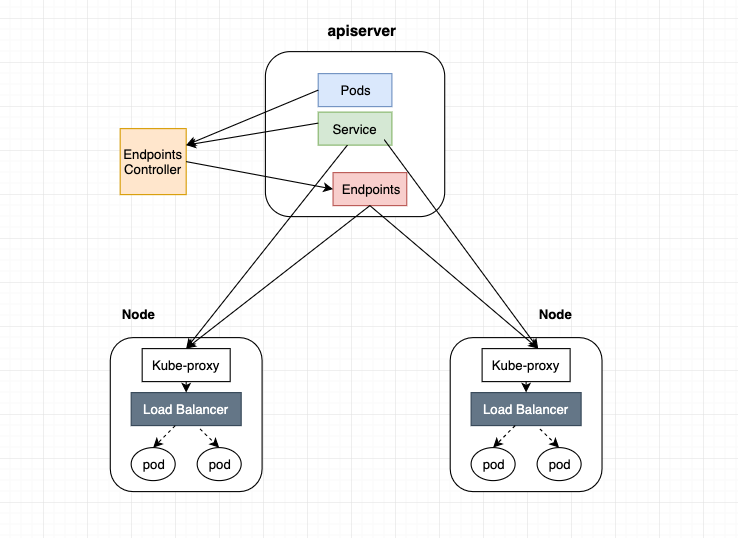

# 1. 什么是负载均衡？

一种充当反向代理的设备，将网络或应用流量分配与多个服务器，以提高并发能力和可用性。

工作层：

- 3层：根据IP分发请求，比如等价路由（ECMP）
- 4层：根据TCP、UDP分发请求，比如LVS
- 7层：根据HTTP、HTTPS分发请求，比如Nginx

解决场景：

- 负载分担：分担业务压力，通过某种算法将负载分发到各个服务器上。
- 安全：客户不知道真实的服务器。
- 故障隔离：某个服务器出现故障时，无人工干预的情况下自动被隔离。
- 高可用：后端服务器在故障、升级、重启的情况下，能不间断为客户提供服务。
- 其他：访问控制、流量监控等

# 2. kubernetes中的负载均衡

## 2.1. kubernetes service

service 是一组具有相同 label pod 集合的抽象，集群内外的各个服务可以通过 service 进行互相通信。service 只是将多个 pod 进行关联，实际的路由转发需要依赖其他组件来实现。

提供能力的组件：

- kube-proxy（iptables、ipvs）
- cilium（ebpf）
- metallb（提供LoadBalancer Service能力）


### 2.1.1. service 类型

- ClusterIP
- NodePort
- LoadBalancer
- ExternelName
- Headless

```yaml
apiVersion: v1
kind: Service
metadata:
  name: my-service
  namespace: prod
spec:
  type: ExternalName
  externalName: nginx.default.svc.cluster.local

# 当查找主机 my-service.prod.svc.cluster.local 时，集群DNS服务返回 CNAME 记录，其值为 nginx.default.svc.cluster.local
# ExternalName 这种 service 类型的作用类似软链接或者快捷方式。
# client -> my svc -> nginx svc -> nginx pod
```

## 2.2. kubernetes ingress

# 3. service原理

- endpoints controller 是负责生成和维护所有 endpoints 对象的控制器，监听 service 和对应 pod 的变化，更新对应 service 的 endpoints 对象。当用户创建 service 后 endpoints controller 会监听 pod 的状态，当 pod 处于 running 且准备就绪时，endpoints controller 会将 pod ip 记录到 endpoints 对象中，因此，service 的容器发现是通过 endpoints 来实现的。
- kube-proxy 会监听 service 和 endpoints 的更新并调用其代理模块在主机上刷新路由转发规则。



另外，可以在集群中部署 CoreDNS 服务， 来达到集群内部的 pod 通过DNS 的方式进行集群内部各个服务之间的通讯。

所以，service

- 容器发现，是通过 endpoints 来实现；
- 服务发现，是通过 DNS 来实现；
- 负载均衡以及转发是通过kube-proxy（或其他替代组件）实现的；

# 4. kube-proxy

## 4.1. iptables
## 4.2. ipvs

# 5. cilium

# 6. metallb
